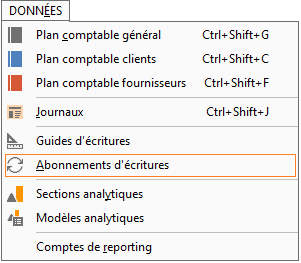
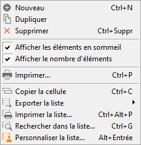

# Liste des abonnements

La gestion des abonnements est accessible à partir du menu Données / 
 Abonnement d'écritures et permet d’obtenir la liste des abonnements paramétrés.

 

 

La gestion des abonnements (création, 
 modification, suppression, 
 impression) s’effectue à partir 
 d'un clic droit dans la liste, ou des raccourcis clavier.

 

 

Toutes les listes ont un fonctionnement commun (voir Utilisation des 
 listes).

 

