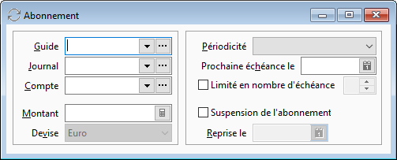
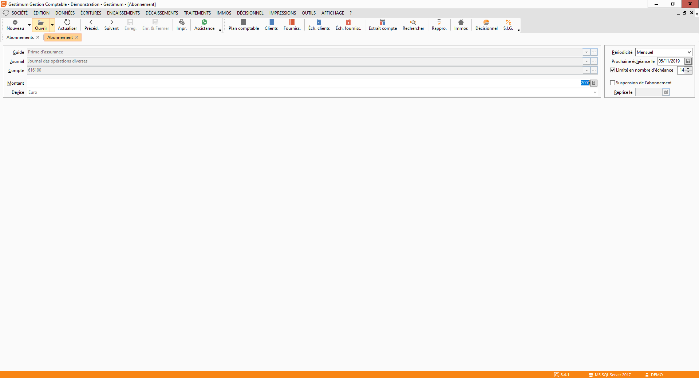

# Création d'un abonnement

 

La création d'un abonnement d'écriture s'effectue soit depuis la [liste des abonnements](../2/ListeAbonnements.md), soit depuis la liste des [échéances 
 d'abonnement](../4/EchéancesAbonnements.md), à l'aide d'un clic droit dans la liste puis Nouveau. 
 La fenêtre suivante s'ouvre :

 

 

Un abonnement d'écritures est obligatoirement décrit par :

 

* un guide : sélectionner 
 le guide souhaité en saisissant son code ou en le sélectionnant à 
 l'aide du menu déroulant,
* un journal 
 : sélectionner le journal dans lequel vous souhaitez que les écritures 
 soient générées,
* un compte 
 : ce compte devra être de la même racine que le compte défini dans 
 la première ligne du guide, si ce dernier n'a pas été défini par défaut 
 dans le guide,
* un 
 montant : le montant de l’abonnement doit être strictement 
 positif,
* une devise 
 : par défaut, c'est la devise du dossier qui 
 est proposée,
* une périodicité 
 : sélectionner la périodicité souhaitée à l'aide du menu déroulant,
* la date de la prochaine échéance,
* la 
 limite en nombre d’échéances : permet de définir combien de 
 fois l'écriture d'abonnement devra être générée,
* Suspension 
 de l’abonnement : permet de bloquer la génération des échéances liées 
 à l’abonnement,
* Reprise 
 le : option associée à la suspension de l’abonnement qui permet de 
 reprendre la génération des écritures à une date précise.

 

Après avoir renseigné les zones souhaitées, il vous suffit d'enregistrer 
  et votre abonnement d'écriture est créé.

 

 

Vous pouvez alors consulter la liste des échéances associées à votre 
 abonnement d'écriture, dans la [liste 
 des échéances d'abonnements](../4/EchéancesAbonnements.md).

 

