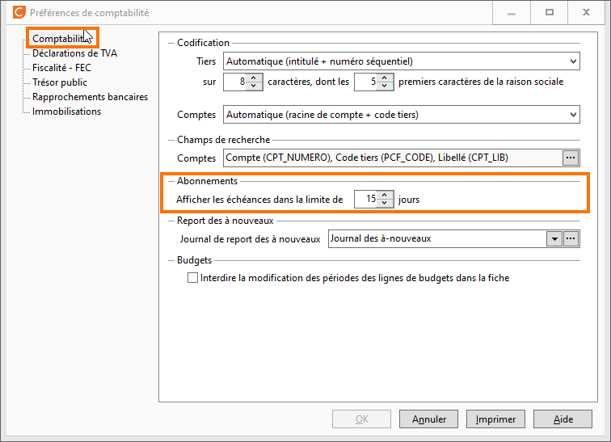

# Echéances d'abonnements

Il est possible de paramétrer l'affichage de la liste des échéances 
 d'abonnements d'écritures, à partir des Préférences de la comptabilité/ 
 Onglet comptabilité / Abonnements

 

 

Afficher les échéances dans la limite de x jours, permet déterminer 
 dans la limite de combien de jours vous souhaiter voir les échéances à 
 générer à partir de la date du jour.

 

La liste des échéances d'abonnements est accessible depuis le menu Écritures 
 / Échéances d'abonnements

 

 

### Liste des échéances

La liste contient uniquement les échéances d’abonnement à générer dans 
 les x jours à partir de la date du jour. 

 

Pour chaque ligne d’échéance, vous obtenez le détail de l’abonnement 
 :

* la date d’échéance,
* le code journal de l'écriture,
* le montant de l'écriture,
* le modèle d'imputation comptable utilisé,
* un commentaire indiquant les écritures à générer et dans combien 
 de jours.

 

Certaines lignes des échéances d’abonnements peuvent apparaître dans 
 une autre couleur, cela signifie que l’échéance est dépassée de x jours.

 

Vous pouvez personnaliser l'affichage de la grille via un clic droit 
 / Personnaliser la liste.

### Générer les écritures d’abonnement

Pour générer les écritures correspondantes 
 aux échéances d’abonnement, vous devez sélectionner les lignes d’abonnements 
 par un clic ou par le menu contextuel, demander "Tout 
 sélectionner", il en va de même pour "Tout 
 désélectionner". 

 

Ensuite vous devez cliquer sur le bouton 
 "Générer" qui se trouve 
 en bas. Vous accédez alors à la fenêtre de saisie guidée. 

 

 

Il suffit de valider la fenêtre ou d’effectuer 
 les modifications nécessaires. En cliquant sur  "Ok" et  votre écriture 
 sera générée dans votre journal comptable.

 

 

La liste de vos échéances d'abonnements 
 est alors actualisée.

 

