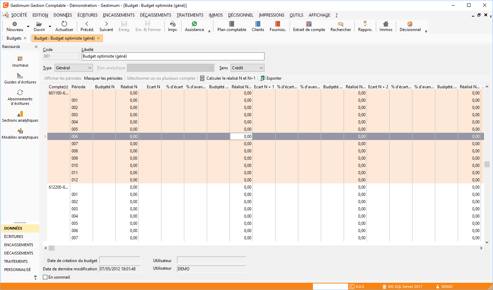

# Budget

Un budget (menu Traitements) est obligatoirement décrit par un code et un libellé.

 

 

Ensuite, vous devez définir un exercice, 
 un type, un sens 
 et les lignes de budgets.

## Entête de fiche

### Exercice

Le budget peut être défini pour l’exercice courant ou l’exercice supérieur.

### Type

Un budget de type "Général" compare le prévu avec le réalisé 
 sur les comptes comptables.

Un budget de type "Analytique" compare le prévu avec le réalisé 
 sur les sections analytiques d’un plan donné.

### Plan

Ce champ est actif uniquement pour les budgets 
 de type "Analytique".

 

Les plans analytique proposés dans la liste 
 déroulante sont ceux créés précédemment dans les tables de référence.

### Sens

Permet d’indiquer le sens du solde à comparer.

 

Généralement, "Crédit" pour des répartitions de produits, 
 et "Débit" pour des charges.

## Ligne de budget

La ligne de budget est obligatoirement 
 composée d’un intitulé, d’une répartition et d’un montant prévu annuel 
 et de montants périodiques.

### Intitulé

A saisir en premier pour créer la ligne de budget.

 

A la saisie, la ligne s’active ce qui permet de définir la répartition 
 des comptes ou des sections et d’accéder au détail des périodes (double 
 clic dans la zone période)

### Répartition

La touche F4 ouvre la liste des comptes ou des sections analytiques 
 du plan afin que vous puissiez les sélectionner. Cette ouverture est également 
 disponible à partir du menu contextuel.

 

Le pied de la fiche indique également la manipulation à réaliser pour 
 accéder aux listes (plan comptable et sections analytiques) pour la répartition 
 et pour la liste des périodes.

 

La répartition peut être exprimée avec des tirets pour séparer les comptes 
 ou avec des points virgules pour définir un intervalle des comptes, exemple 
 :

601100-607200;661100-661880.

 

Même gestion pour les sections analytiques.

### Montant et périodes

Le montant prévu peut être saisi pour un exercice ou par période. Le 
 montant exercice (colonne Prévu) est réparti automatiquement sur les périodes 
 de l’exercice.

 

Le double clic permet respectivement d’ouvrir/de fermer le détail des 
 périodes de l’exercice (colonne Période).

 

Un montant particulier peut ainsi être défini pour chaque période ce 
 qui recalcul automatiquement le montant prévu total.

## Calcul du budget et résultat

Suite à la sélection du bouton calculer, vous obtiendrez un comparatif 
 entre prévu et réalisé pour une période : exercice, trimestre, ou encore 
 un intervalle précis.

### Calcul du comparatif

Le bouton "Calculer" permet de lancer le calcul ou de mettre 
 à jour, pour chaque ligne de budget, le montant réalisé sur la période 
 ainsi que l’écart en pourcentage ou en valeur entre le prévu et le réalisé 
 (par le menu contextuel).

 

Lorsque les montants ne sont pas à jour, un message vous le signale 
 dans l’entête du budget.

### Exploiter le comparatif

A partir du moment où toutes les lignes sont calculées, il vous est 
 possible de récupérer ces lignes dans le tableur Excel afin d’exploiter 
 les informations qu’elles contiennent.

 

Pour cela, cliquez simplement sur le bouton .

 

Le logiciel ouvre alors l’application Excel et crée une feuille contenant 
 les informations de votre budget.

### Imprimer le comparatif

Le menu contextuel permet d’imprimer les colonnes de la grille de votre 
 budget.

### Menu contextuel

En plus des fonctionnalités disponibles sur les autres listes, vous 
 disposez des fonctions suivantes :

* Ajouter 
 une ligne,
* Supprimer 
 une ligne,
* Afficher 
 la répartition mensuelle : répartition affichée par compte, un double 
 clic sur la ligne du compte masque cette totalisation,
* Plan 
 comptable (F4),
* Duplication,
* Duplication 
 sur réalisé : seulement le réalisé est récupéré sur la fiche 
 dupliquée.

