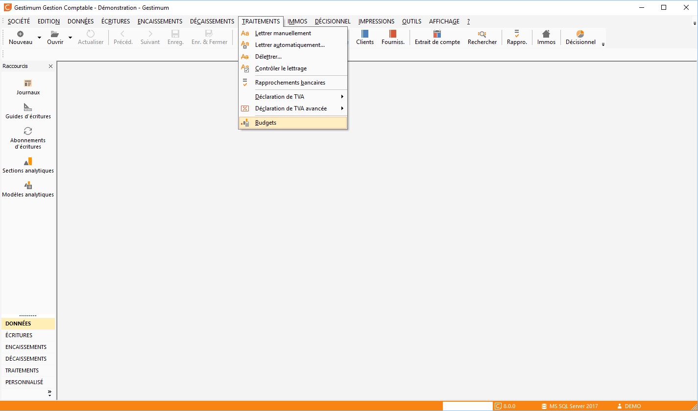

Budgets de A à Z

La gestion budgétaire permet d’effectuer un comparatif en temps réel entre le CA prévu et le CA effectivement réalisé. Le budget peut s’appliquer sur la comptabilité générale ou sur la comptabilité analytique

## Affichage de la liste des budgets (Traitements/Budgets)

 

## Description d’une fiche budget

### ENTÊTE DE FICHE

#### Type

Un budget de type Général compare le prévu avec le réalisé sur les comptes comptables

Un budget de type Analytique compare le prévu avec le réalisé sur les sections analytiques d’un plan donné

#### Plan

Ce champ est actif uniquement pour les budgets de type Analytique. Les plans analytiques proposés dans la liste déroulante sont ceux créés précédemment dans les tables de référence

#### Sens

Permet d’indiquer le sens du solde à comparer. Généralement, Crédit pour des répartitions de produits et Débit pour des charges

## Création d’un nouveau budget

Ouvrir la liste des budgets et faire un clique droit sur la page, puis Nouveau.

 

Vous arrivez donc sur une page dans laquelle il est important de bien faire attention à toutes les informations saisies.

 

Sur votre nouveau «Budget» saisissez un «Code», un «Libellé» et dans «Compte(s)» choisissez sur quel compte vous voulez faire votre Budget (Exemple compte 601101).

 

Enfin dans la partie «Budgété N» veuillez insérer le montant Budgété puis faire «flèche bas sur votre clavier» afin que le logiciel répartisse sur les 12 mois le montant.

 

Ensuite quand vous ferez des écritures avec ce compte 601101 votre budget sera modifié en conséquent. (Important n’oubliez pas d’utiliser «Calculer le réalisé N et N+1 avant enregistrement).

## L’alerte en fonction du budget

En gestion commerciale vous pouvez mettre une alerte sur dépassement de budget. Ceci afin de lier le contrôle des achats avec la gestion budgétaire en comptabilité.

 

Allez dans «SOCIETE/Paramétrage/Préférences de gestion».

 

Allez dans l’onglet «Achat» puis paramétrez en fonction de vos préférences.

 

Allez dans l’onglet «compta» d’une fiche article puis paramétrez votre «compte général» d’achat (en rapport avec votre budget).

 

Allez dans un document d’achat (l’alerte budget ne marchera qu’à partir d’une commande).

### Message avec dépassement de budget

### Message avec blocage du budget

