# Déclarer la TVA de A à Z

Une société, lorsqu'elle effectue des achats et des ventes, comptabilise de la TVA déductible (achats) et de la TVA collectée (ventes).

 

La TVA déductible est une créance envers l'état, et la TVA collectée est une dette envers l'état

Périodiquement (mensuellement, trimestriellement... Selon le régime fiscal choisi), cette société doit solder (= annuler) sa dette et sa créance de TVA.

 

Si la dette est supérieure à la créance, alors elle doit reverser cette différence, dans le cas contraire elle peut soit récupérer cette différence (remboursement de TVA), soit la reporter pour le mois suivant (crédit de TVA).

## Personnaliser le plan comptable

Renseigner le compte de TVA lorsque nécessaire (onglet "information" du compte). Pour les comptes de TVA, saisir le "taux", le "type de TVA" et le "type d’opération".

 

Les champs "Ventilation TVA" et "Ventilation CA" ne sont pas utilisés pour la déclaration de TVA avancée.

 

Sur les comptes de tiers (allez dans Données – Plan comptable client ou plan comptable fournisseur), il n’y a rien à saisir pour le calcul de déclaration de TVA dans l’onglet "Informations". Dans le cadre de la TVA pour les opérations UE, il faut paramétrer les comptes de ventes en associant un compte de TVA au compte.

## Paramétrage des déclarations de TVA

Allez dans "Traitements/Déclaration de TVA avancée/Paramétrer la déclarations de TVA".

 

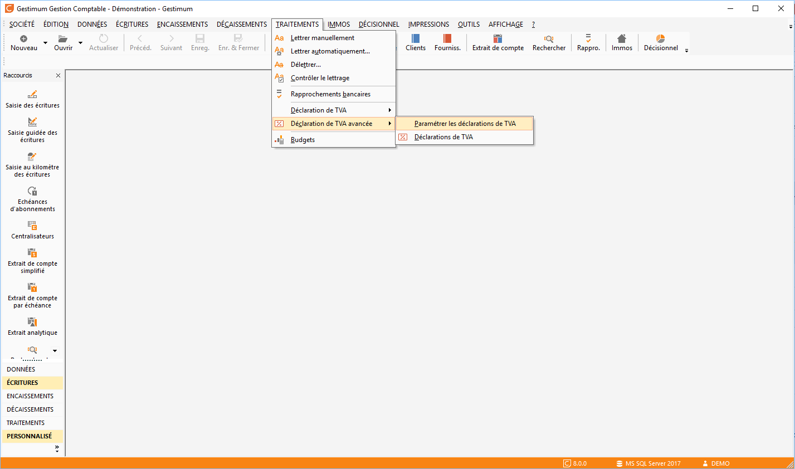

 

Vous accéder alors aux fenêtres de paramétrage Regroupements et Lignes. L’onglet "Regroupements" permet de paramétrer la collecte des valeurs (Base et montant servant à la déclaration) en fonction des différents cas de TVA qui s’applique dans l’entreprise (TVA au débit, TVA à l’encaissement, Exonéré, DOM TOM, etc.).

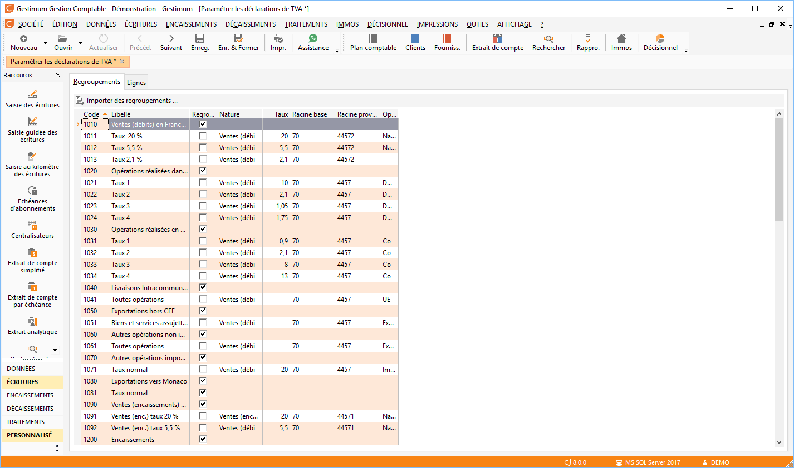

 

"Importer des regroupements" permet d’importer un paramétrage de base situé dans le répertoire BASE de l’installation Gestimum sous le nom CA3 France.TVARegroupements.

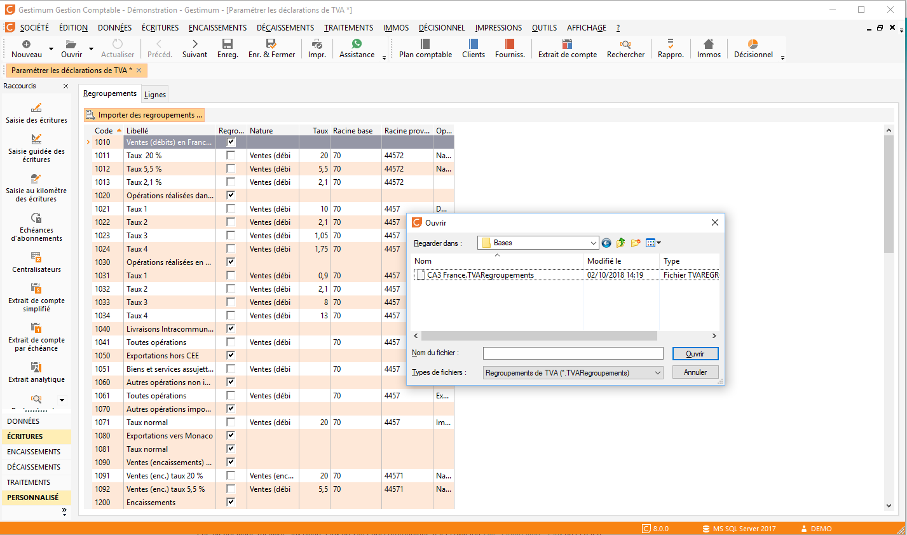

 

Pour ajouter ou supprimer des lignes de paramétrage dans les deux fenêtres, utiliser la touche "Insert" ou "Suppr" de votre clavier.

 

L’onglet "Lignes" permet de paramétrer les différentes zone de la déclaration CA3 de TVA en définissant les codes de regroupement devant être pris en compte au niveau de la base ou des montants.

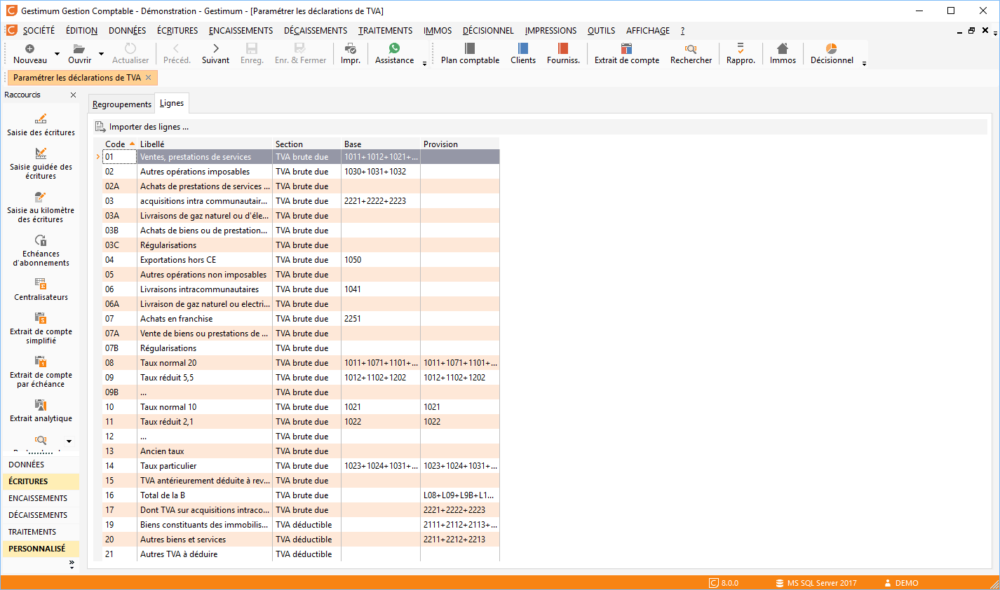  

"Importer des lignes" permet d’importer un paramétrage de base situé dans le répertoire BASE de l’installation Gestimum sous le nom : CA3 France.TVALignes.

 

Il faut prévoir une ligne de regroupement par cas de TVA applicable dans la société et donc par compte de TVA défini dans le plan comptable. Saisir dans la colonne "Racine provision" le N° de compte de TVA concerné. Il faut également que les champs "nature", "Opération", "Taux" soit en concordance avec ceux défini dans le compte de TVA dans l’onglet "Information".

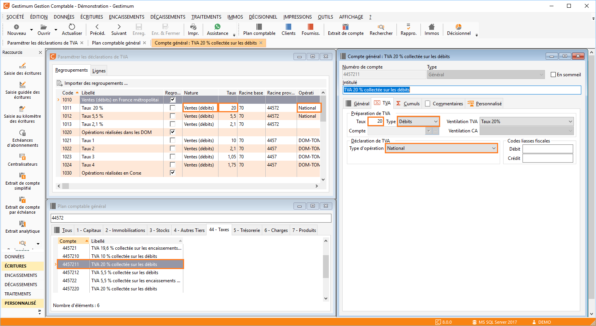

### Grille d’affichage du plan comptable (Données – Plan comptable général)

Déclaration de TVA type d’opération TVA :

* National = P
* UE = C
* Dom Tom = D
* Vide = F
* Non imposable = N
* Imposable = I

Préparation de la TVA – Type :

* Débits = D
* Décaissements = R
* Débits non perçus = 2
* Encaissements = E
* Facturation = F
* Collectée non perçu = 1

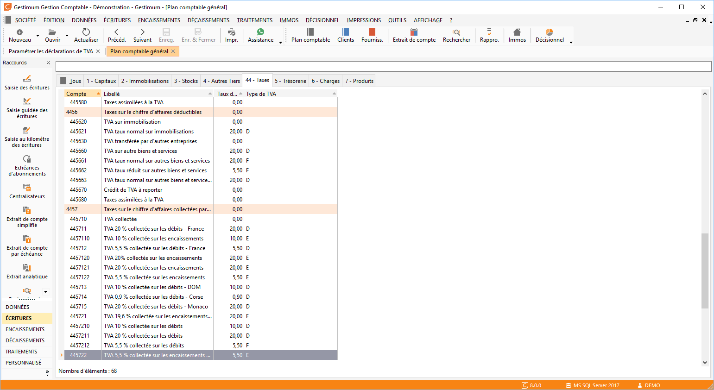

### Paramétrage des Lignes

Il faut alors saisir dans "base" quand il s’agit de la base de déclaration, ou dans "provision" quand il s’agit des montant de TVA à déclarer, les codes des lignes de regroupements définies lors de l’étape précédente.

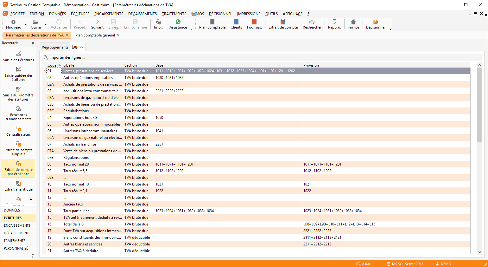

 

Le code défini la zone de la déclaration de TVA concerné :

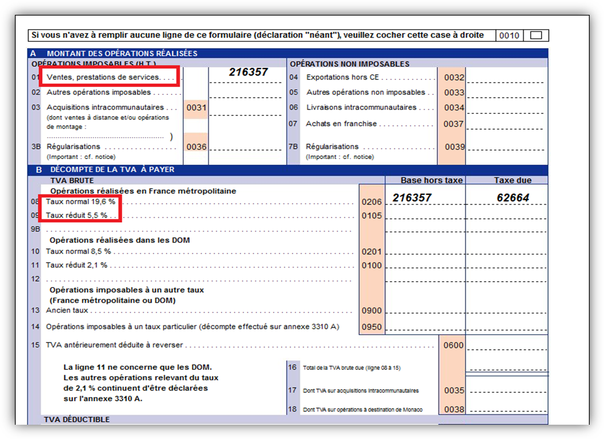

### Cas particuliers

TVA à l’encaissement : Lors du calcul de la déclaration le logiciel affecte sur la ligne de regroupement Vente (Encaissement) la base et le montant de l’écriture de la période.

### Écriture

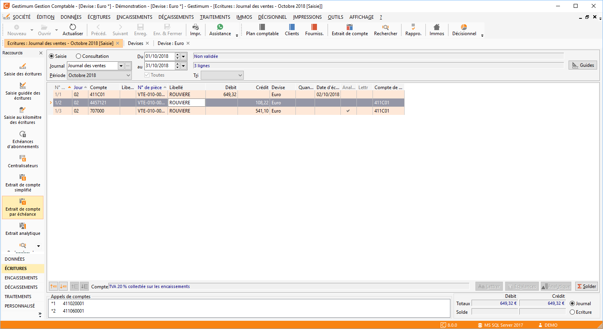

### Résultat du calcul de TVA

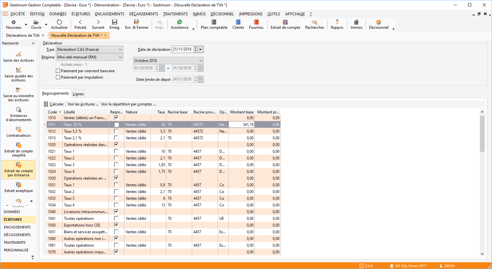

 

Lors de la saisie du règlement directement en comptabilité quelques soit le journal de Trésorerie, ou du tiers client le logiciel vous demande de confirmer la part de TVA sur encaissement du règlement.

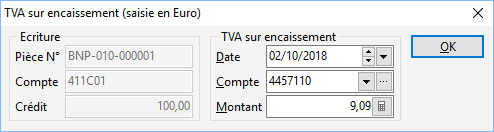

### Résultat sur le calcul de la TVA

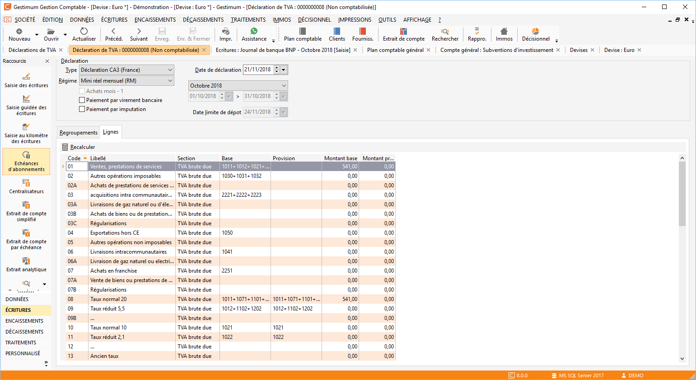

Le logiciel alimente alors automatiquement la ligne Encaissement (Vente) ayant le compte de TVA sur lequel le règlement a été imputé à l’écran précédant.

 

Aucun contrôle ne semble effectué, lors de la saisie du règlement, quant à l’existence d’une facture ayant de la TVA à l’encaissement.

### Cas des bases à collecter sans TVA dans les écritures ou sur les factures.

Il a été mis en place une nature "Collecté suivant le compte" ou "Déductible suivant le compte" qui permet la collecte de montant des écritures des comptes de produits ou de charges sans affectation d’un compte de TVA.

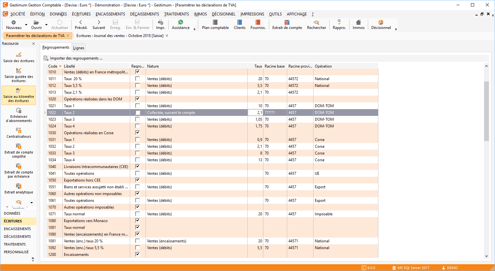

 

Le ??? est un caractère joker (dans l’exemple il permet de sélectionner une séquence de compte commençant par 7 et finissant par 1 sur le 6ième caractère). Il est faut donc utiliser le dernier caractère pour différentier les comptes de charges ou produits des DOM TOM ou UE ou Exonéré.

 

Exemple : Compte personnalisé précédemment

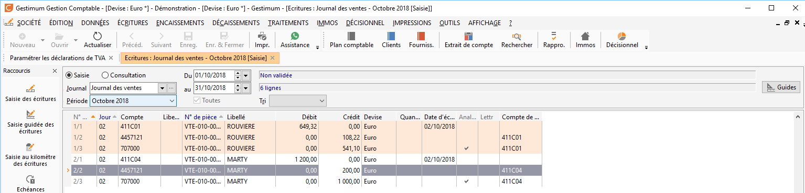 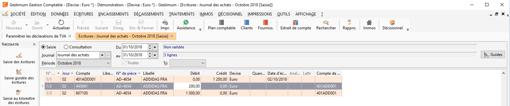

## Lancement du calcul de la déclaration de TVA

Allez dans "Traitements – Déclaration de TVA avancée – Déclaration de TVA" et faites clic droit "Nouveau".

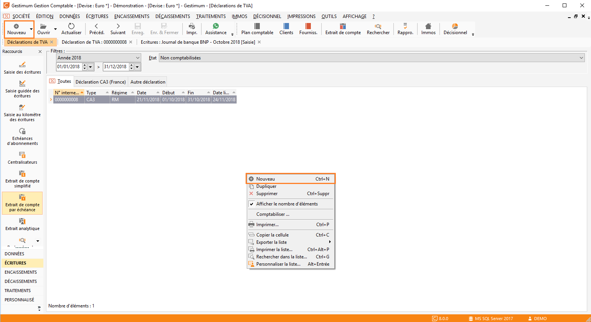

Sélectionnez le "type", le "régime", la "date de la déclaration", la "période" de calcul de la TVA et le "mode de paiement" puis cliquer sur "Calculer":

 

En se positionnant sur chaque ligne calculée, il est possible de visualiser les écritures en faisant clic droit "Voir les écritures".

Possibilité de visualiser le récapitulatif par comptes

Enfin cliquez sur "Enregistrer" puis "imprimer". Sélectionnez le nom du modèle – le CERFA adapté à l’année concernée.

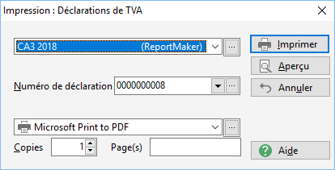

 

Vous obtiendrez votre déclaration de TVA.

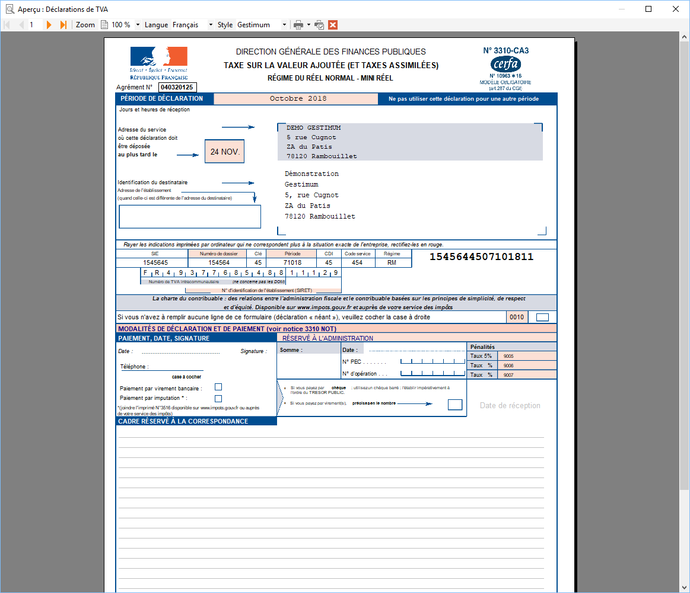  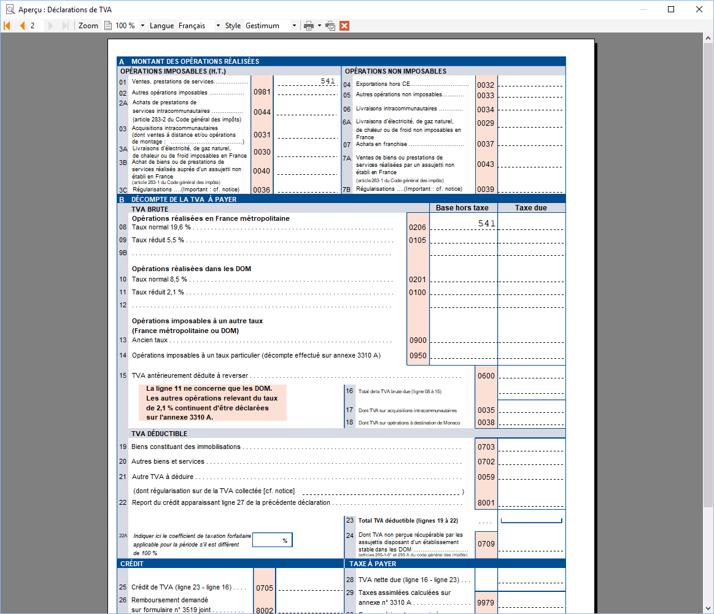

 

Pour passer l’écriture comptable, repositionnez vous sur la liste des déclarations de TVA "Menu traitement – Déclaration de TVA avancée – Déclaration de TVA" faites clic droit "Comptabiliser".

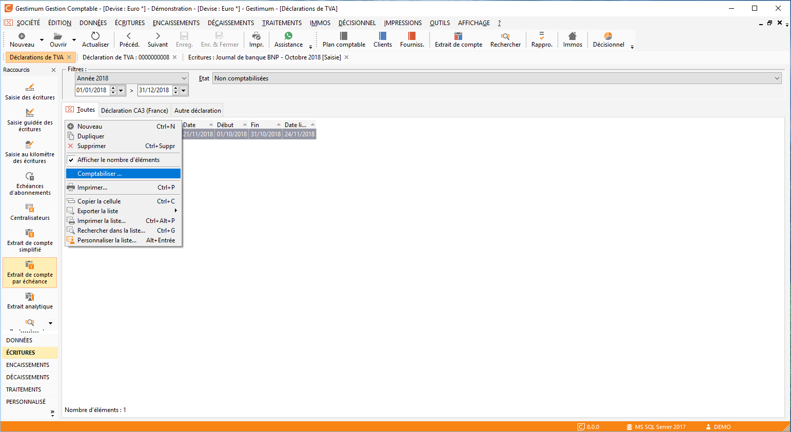

