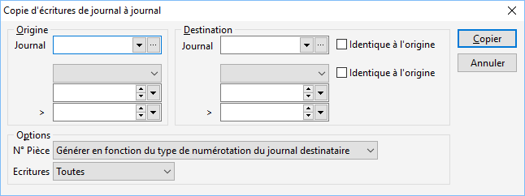

# Copier des écritures de journal à journal

Ce traitement permet de copier des écritures :

 

* d’un journal dans 
 le même journal pour une autre période (sélection de la case "Origine" 
 pour le journal destination)
* d’un journal dans 
 un autre journal du même type pour la même période ou une autre (sélection 
 de la case "Origine" pour la période destination)

 

Vous avez le choix de recopier ou non le numéro 
 de pièce suivant le journal ou l’écriture d’origine.

 

Enfin, vous pouvez faire un tri sur les écritures que vous souhaitez 
 copier (Toutes, Réelles, Simulées).

 

