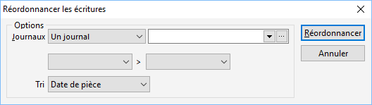

# Réordonnancer les écritures

Ce traitement réorganise les écritures suivant 
 le numéro d’ordre de la base.

 

Avant de lancer ce traitement, il est vivement 
 conseillé de faire une sauvegarde de votre dossier.

 

Vous devez sélectionner un journal, la période pour laquelle 
 vous souhaitez réordonner et indiquer un critère pour trier les écritures 
 (date ou numéro de pièce).

 

