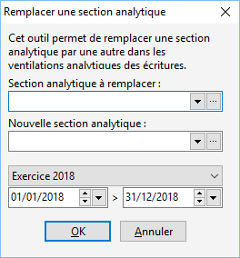

# Remplacer une section analytique

Cet outil permet de remplacer une section analytique par une autre dans les ventilations analytiques des écritures.

 

Vous pouvez le faire en sélectionnant un exercice ou une période plus restreinte.

 

 

