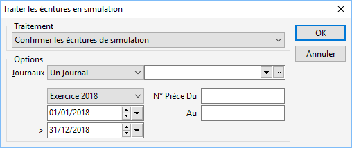

# Traiter les écritures de simulation

La gestion des écritures de simulation permet à tout moment, de confirmer 
 ou supprimer les écritures de simulation pour une période, une [fourchette de journaux](../../Journaux/SelectionJournaux.md) 
 et/ou un intervalle de numéros de pièce.

 

 

De même, il est possible de transformer les écritures réelles en écriture 
 de simulation pour ces mêmes critères.

 

   

