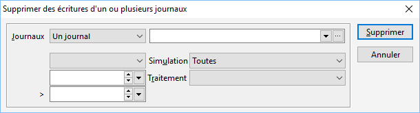

# Supprimer des écritures d'un ou plusieurs journaux

Cette option vous permet de supprimer les écritures. Il est conseillé de faire une sauvegarde de votre base de données.

 

On peut appliquer les filtres suivants :

* [Un ou plusieurs journaux](../../Journaux/SelectionJournaux.md)
* Une période (un exercice, un mois...)
* Écritures en simulation
* Traitement ayant généré l'écriture

 

