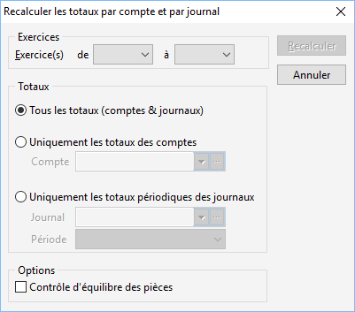

# Recalculer les totaux par compte et par journal

Elle permet de recalculer les totaux des comptes et journaux pour une période déterminée. Pour cela vous devez définir des critères de recalcul.

 

 

Ils sont de deux ordres :

### Sélection des exercices

Vous avez le choix entre l’exercice en cours, l’exercice supérieur ou les deux.

 

La sélection des exercices permet de réduire le temps de traitement de la régénération.

### Sélection des totaux

La définition de ce critère est très importante, le traitement pouvant être plus ou moins long suivant l’option choisie.

 

Trois options sont disponibles :

* Tous les totaux (Comptes & Journaux),
* Uniquement les totaux des comptes,
* Uniquement les totaux périodiques des journaux.

## Tous les totaux (Comptes & Journaux)

Le traitement lance de calcul de tous les journaux et comptes dans la limite de la sélection des exercices. Ce traitement est le plus long.

## Uniquement les totaux des comptes

Ce traitement consiste à recalculer uniquement les totaux des comptes ou les totaux d’un compte précis. Par exemple, vous pouvez lancer le recalcule d’un compte suite à une modification de lettrage ou pour vérifier l’exactitude d’un extrait de compte.

## Uniquement les totaux périodiques des journaux

Le traitement recalcul les totaux pour un journal précis et une période sélectionnée.

Remarque :

* Si aucun journal et aucune période ne sont sélectionnés alors le recalcul s’effectuera sur toutes les périodes pour tous les journaux dans la limite des exercices sélectionnés précédemment,
* Si aucun journal n’est sélectionné, le recalcul s’effectue sur la période pour tous les journaux,
* Si aucune période n’est sélectionnée, le recalcul s‘effectue sur le journal pour toutes les périodes.

## Option

La sélection de l’option "Contrôle d’équilibre des pièces" permet d’effectuer la vérification d’égalité parfaite entre les montants au débit et au crédit pour chaque pièce saisie.

## Lancement de la régénération

Après avoir défini les critères de sélection, vous pouvez lancer la régénération des totaux par le bouton "Recalculer".

 

Un message d’information vous indiquera la fin du traitement. Si un déséquilibre est trouvé, ce message vous donnera les journaux déséquilibrés.

