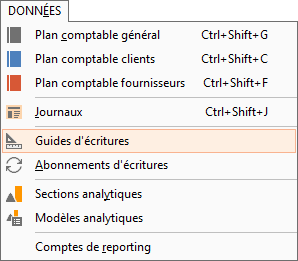
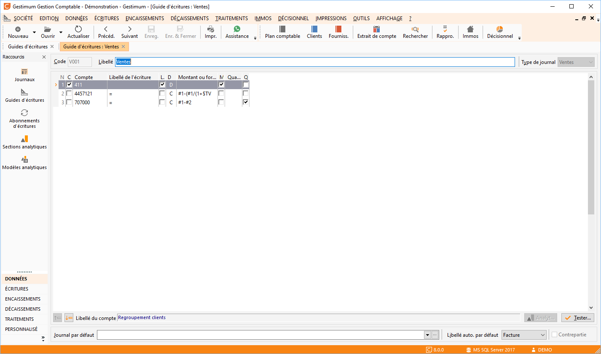
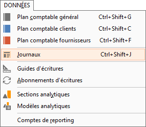
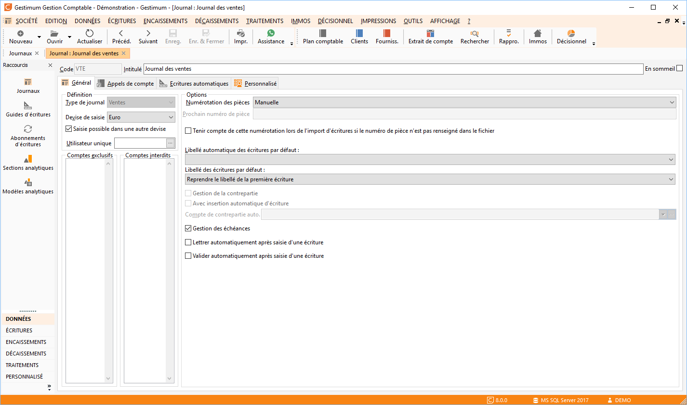
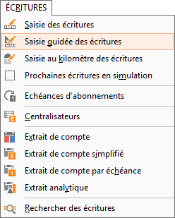

# Saisie guidée de A à Z

## Création d’un guide (Données/Guides d’écritures).

 

Dans la liste de vos guides, faites clic droit 
 nouveau. Les guides permettent d’automatiser les écritures lors de la 
 saisie standard ou avec la saisie guidée. Pour que le guide soit actif 
 lors de la saisie standard, il faut le paramétrer dans le journal concerné 
 onglet "Écritures automatiques".

 

Pour créer une formule il faut utiliser le # 
 pour appeler une ligne et le $ pour appeler une constante numérique (issue 
 des tables de référence) – (vous pouvez visualiser votre guide en cliquant 
 en bas à droite de l’écran sur "tester".

 

 

## Paramétrages des journaux

 

 

### Onglet Général

Permet de définir l’un des quatre types de journal (Ventes, Achats, 
 trésorerie, OD). La notion d’utilisateur unique permet d’associer un seul 
 des utilisateurs malgré les droits utilisateurs définit dans la gestion 
 des utilisateurs. Les options permettent de définir les réglages nécessaires 
 pour la saisie d’écriture.

### Appels de compte

Permet de créer des raccourcis de comptes auxquels vous pouvez également 
 définir un montant ou une formule de calcul. Ces appels de comptes seront 
 rappelés dans la fenêtre de saisie d’écriture.

### Écritures automatiques

Permet d’appeler un guide d’écriture en fonction du premier compte de 
 l’écriture. Il est possible de définir un compte collectif afin d’appeler 
 le guide lors de la saisie d’un compte tiers.

### Champs utilisateurs

Les champs utilisateurs permettent d’insérer des champs de types variés 
 pour insérer des données propres au dossier.

## Création d’une saisie guidée

 

 

Le masque de saisie proposé correspond exactement 
 au paramétrage du guide choisi. Le masque est composé d’un entête, des 
 lignes d’écriture du guide et d’un pied.

z

 

Sélectionnez votre "Journal" Puis 
 renseignez votre "compte" et votre "Débit", le logiciel 
 se chargera de remplir les autres informations. Puis faites "OK".

