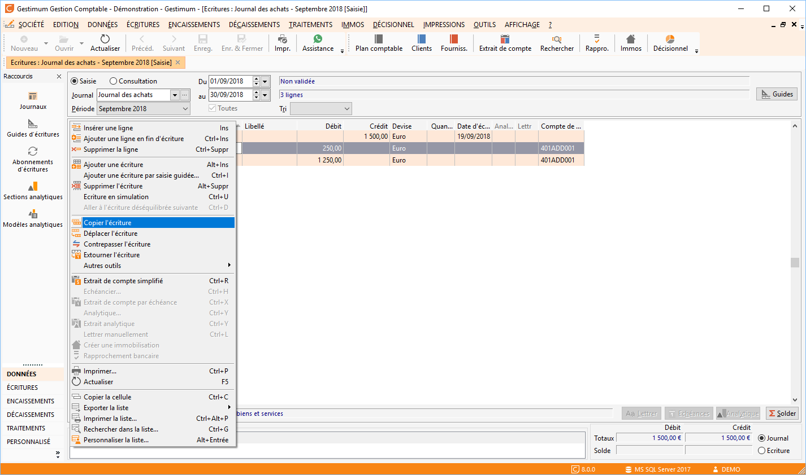
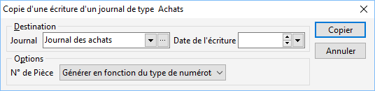
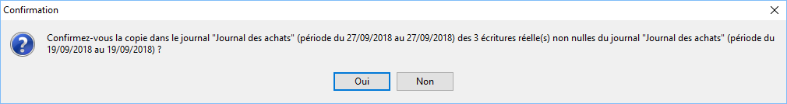
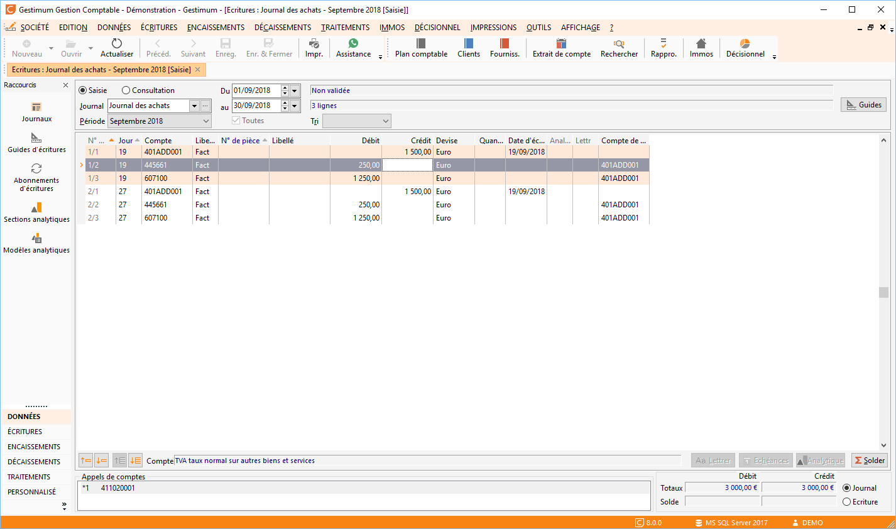

# Copier une écriture

Cette fonction va permettre de copier cette écriture du mois d’Avril 
 vers le mois de Mai.

 

Faites clic droit sur l’écriture puis "Copier l’écriture".

 

 

 

Une fenêtre s’ouvre et vous propose de sélectionner la "Destination" 
 ainsi que la "Date de l’écriture".

 

Dans l’exemple je choisis de mettre mon écriture au 27 septembre.

 

 

 

 

En retournant dans le journal des ventes au mois de Septembre on constate 
 que l’écriture d’origine à bien été copiée dans mon journal.

 

