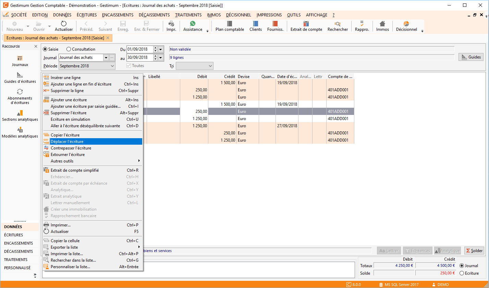
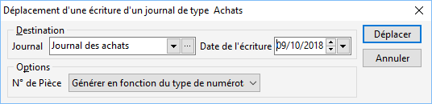
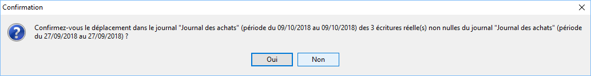
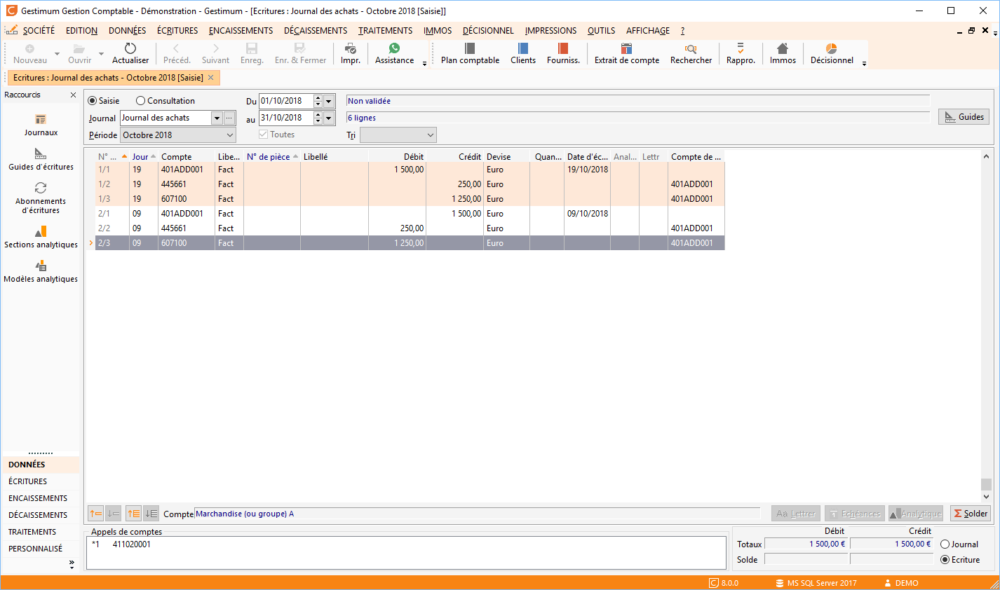

# Déplacer une écriture

Vous faites clic droit sur l’écriture puis "Déplacer l’écriture".

 

 

 

Il faut sélectionner votre "Destination" puis la "Date 
 de l’écriture".

 

 

 

Votre écriture sera ainsi déplacée vers la date sélectionnée.

 

