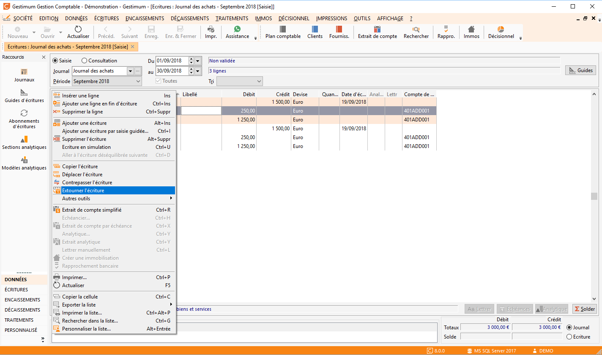
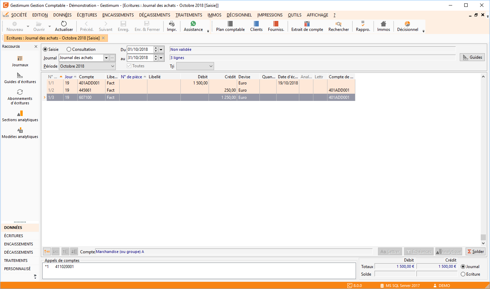

# Extourner une écriture

Dans le même principe que le chapitre "Copier une écriture" 
 vous avez la possibilité d'extourner vos écritures.

 

 

 

Donc l’écriture se retrouve dans le journal du mois suivant.

 

