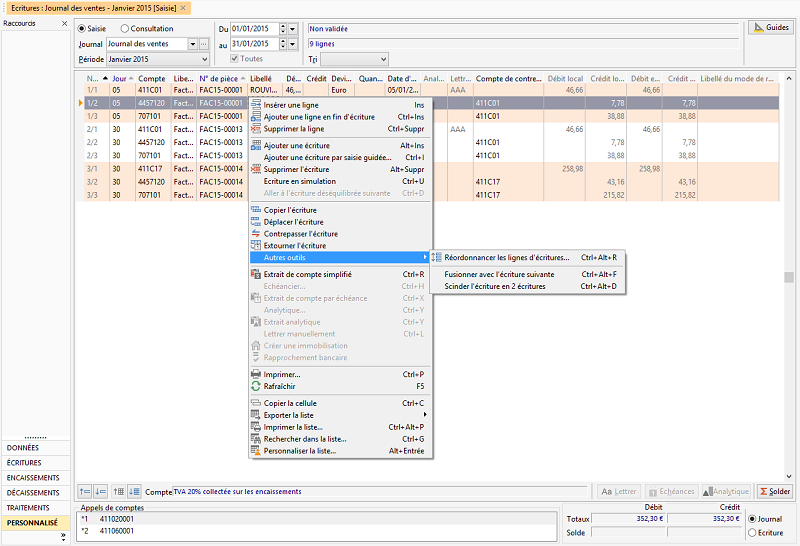

# Zones de la saisie standard

Cliquez sur une zone de l’écran pour obtenir une aide détaillée :

 

                                                         

 

 //<![CDATA[
 if (typeof(FilePopupInit) != 'function') FilePopupInit = new Function();
 FilePopupInit('AREA1');
 FilePopupInit('AREA2');
 FilePopupInit('AREA4');
 FilePopupInit('AREA3');
 FilePopupInit('area5');
 FilePopupInit('AREA6');
 FilePopupInit('AREA7');
 FilePopupInit('AREA8');
 FilePopupInit('AREA9');
 FilePopupInit('AREA10');
 FilePopupInit('AREA11');
 FilePopupInit('AREA12');
 FilePopupInit('AREA13');
 FilePopupInit('AREA14');
 FilePopupInit('AREA15');
 FilePopupInit('AREA16');
 FilePopupInit('AREA17');
 FilePopupInit('AREA18');
 FilePopupInit('AREA19');
 FilePopupInit('AREA20');
 FilePopupInit('AREA21');
 FilePopupInit('AREA22');
 FilePopupInit('AREA23');
 FilePopupInit('AREA24');
 FilePopupInit('AREA25');
 FilePopupInit('AREA26');
 FilePopupInit('AREA27');
 FilePopupInit('AREA28');
 FilePopupInit('AREA29');
 FilePopupInit('AREA30');
 FilePopupInit('AREA31');
 FilePopupInit('AREA32');
 FilePopupInit('AREA33');
 FilePopupInit('AREA34');
 FilePopupInit('AREA35');
 FilePopupInit('AREA36');
 FilePopupInit('AREA37');
 FilePopupInit('AREA38');
 FilePopupInit('AREA39');
 FilePopupInit('AREA40');
 FilePopupInit('AREA41');
 FilePopupInit('AREA42');
 FilePopupInit('AREA43');
 FilePopupInit('AREA44');
 FilePopupInit('AREA45');
 FilePopupInit('AREA46');
 FilePopupInit('AREA47');
 FilePopupInit('AREA48');
 FilePopupInit('AREA49');
 FilePopupInit('AREA50');
 FilePopupInit('AREA51');
 FilePopupInit('AREA53');
 FilePopupInit('AREA54');
 FilePopupInit('AREA55');
 FilePopupInit('area56');
 FilePopupInit('area57');
 FilePopupInit('area58');
 //]]>
 
