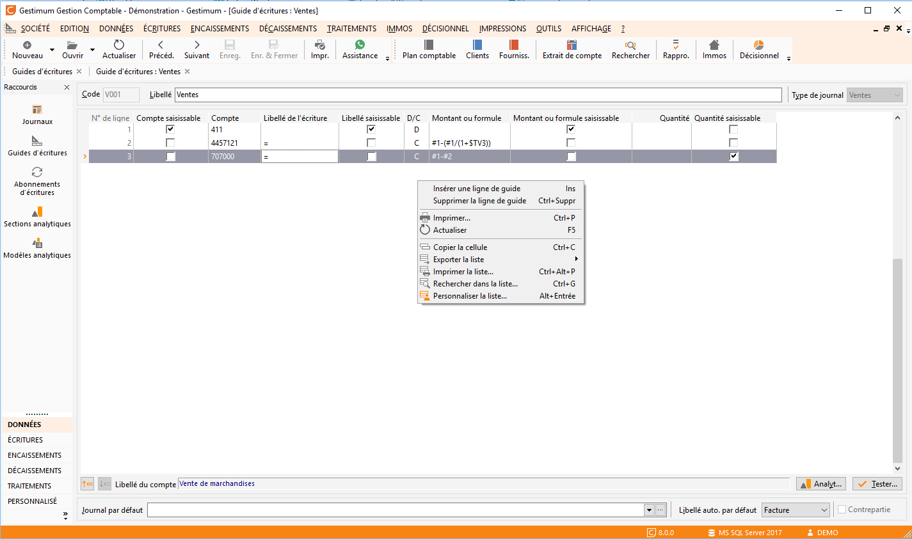

# Guide2

La définition des lignes du guide doit être effectuée avec le plus grand 
 soin.

 

Avant de commencer à paramétrer ces lignes, il est indispensable de 
 déterminer :

* Par quel moyen 
 ce guide va être activé,
* Quelles sont les 
 informations connues et les informations à saisir.

 

Une ligne de guide est décrite par un compte, un libellé, un sens, un 
 montant ou une formule et une quantité (si vous gérez les quantités).

 

Pour chaque ligne, vous devez déterminer les informations qui seront 
 saisies ou modifiables à l’appel du guide et celles qui seront fixes. 
 A partir de là, il vous suffit de rendre ou non accessible telle ou telle 
 information en cochant la case située à côté de celle-ci.

 

Cliquez sur une zone de l’écran pour obtenir une aide détaillée :

 

  

//<![CDATA[
 if( typeof( FilePopupInit ) != 'function' ) FilePopupInit = new Function();
 FilePopupInit('area15');
 FilePopupInit('area16');
 FilePopupInit('area17');
 FilePopupInit('area18');
 FilePopupInit('area19');
 FilePopupInit('area20');
 FilePopupInit('area21');
 FilePopupInit('area22');
 FilePopupInit('area23');
 FilePopupInit('area24');
 FilePopupInit('area25');
 FilePopupInit('area26');
 FilePopupInit('area27');
 FilePopupInit('area28');
//]]>
