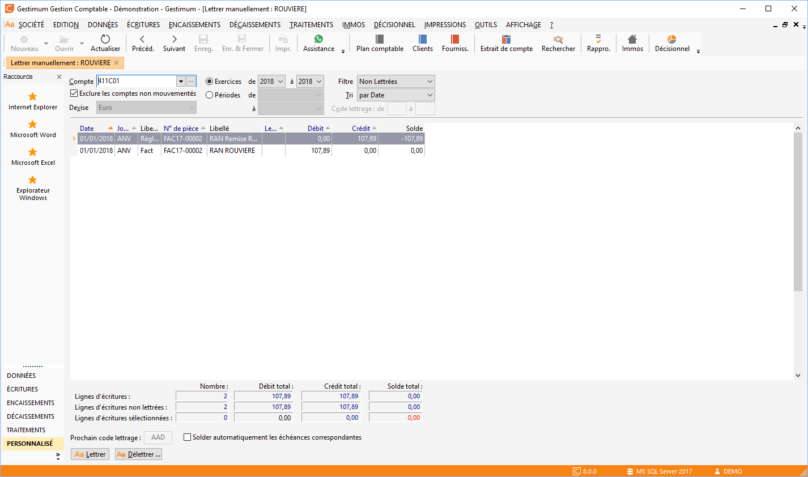
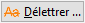

# Lettrage manuel

Le lettrage manuel (menu Traitements) sert généralement à pointer des écritures particulières non trouvées par le [lettrage automatique](../3/LettrageAutomatique.md).

 

 

La fenêtre de lettrage manuel peut être activée automatiquement à partir de la saisie standard en cochant l’option "Lettrage systématique après saisie d’écriture" dans la fiche du journal (onglet Général).

 

Le lettrage manuel donne également accès au [lettrage automatique](../3/LettrageAutomatique.md) et un [délettrage](../5/Delettrage.md) sur le compte en cours.

## Définition du lettrage manuel

L’entête permet de sélectionner :

* le compte auxiliaire à lettrer,
* la période,
* la période sur laquelle vous souhaitez obtenir les écritures du compte,
* le type d’écriture à afficher,
* l’ordre de tri des écritures : par date ou par montant.

## Type d’écriture

Par défaut, le logiciel affiche uniquement les écritures non lettrées.

 

Mais vous pouvez demander d’afficher toutes les écritures, les écritures lettrées ou les écritures lettrées avec un code lettrage appartenant à une fourchette précise.

## Devise des montants

Le lettrage est possible uniquement sur des montants en devise locale.

 

Vous pouvez toutefois consulter les montants de vos écritures dans la devise du compte et dans la devise Euro.

## Lettrage des écritures

Le lettrage à pour effet de marquer les écritures sélectionnées avec le dernier code lettrage disponible.

 

Pour chaque ligne d’écriture, le logiciel indique la date de l’écriture, le journal, le libellé automatique, le numéro de pièce, le libellé de l’écriture, le code lettrage, le montant (Débit ou Crédit) et le solde progressif des Écritures concernant le compte.

 

Le calcul du solde progressif se comporte différemment suivant le type d’écriture :

* Si le type d’écriture est "Toutes" ou "Non lettrées", le solde progressif est sur toutes les lignes,
* Si le type d’écriture est "Lettrées", le solde progressif est par code lettrage.

 

La sélection des écritures à lettrer s’effectue par Ctrl+Clic sur chaque écriture, ou par le menu contextuel "Tout sélectionner".

La désélection s'effectue par un simple clic ou menu contextuel "Tout désélectionner".

 

Le lettrage est possible sur des écritures ayant ou non un solde nul. Dans le cas où l’équilibre n’est pas respecté, une fenêtre de [lettrage approché](../4/LettrageApproche.md) vous est proposée pour constater le montant de l’écart et proposer l’écriture de régularisation.

 

Si vous êtes en mode "Consultation : Écriture lettrées", les écritures disparaissent de votre liste.

## Opérations possibles en lettrage manuel

Le lettrage manuel donne également accès :

* à la [saisie standard](../../Ecritures/Saisie/Standard/SaisieStandard.md)
* à la consultation de l’écriture d'origine des écritures d’A-Nouveaux en saisie standard
* au [délettrage des écritures](../5/Delettrage.md)
* au [lettrage automatique](../3/LettrageAutomatique.md) des écritures du compte
* aux informations générales des grilles

## Délettrage

Le [délettrage](../5/Delettrage.md) d’une écriture est possible avec le bouton  ou par le menu contextuel et est automatiquement proposée si vous sélectionnez avec double-clic une ligne d’écriture lettrée.

## Lettrage automatique

Le bouton [Lettrage automatique](../3/LettrageAutomatique.md) ou le menu contextuel permet de lancer un lettrage automatique des écritures limité aux écritures du compte sur la période définie dans l’entête.

## Pied de la fenêtre

En pied de la fenêtre, le logiciel affiche :

* Le nombre d’écritures, le total débit, le total crédit, et le solde pour la période
* Le caractère de lettrage de l’écriture courante et le nombre d’Écriture ayant ce même code lettrage
* Le montant Débit ou Crédit de la ligne courante ou de la sélection d’Écriture

 

