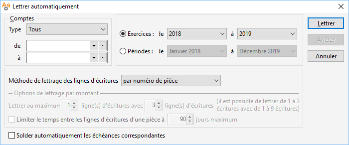

# Lettrage automatique

Le lettrage automatique (menu Traitements) permet 
 de lettrer les écritures d’un compte ou d’une fourchette de comptes.

 

 

Il peut s’effectuer suivant le numéro de pièce, 
 le montant ou de manière combinée (pièce + montant).

## Options de lettrage

### Comptes

Le lettrage peut être appliqué à l’ensemble des comptes de type Lettrable, 
 sur les comptes auxiliaires Clients ou Fournisseurs ou encore sur une 
 fourchette de comptes à définir.

### Période

Par défaut, la période commence de la première période de l’exercice 
 à la période précédant la date du jour.

### Méthode

#### Lettrage par pièces

Le lettrage automatique par pièces est possible 
 uniquement si vus avez enregistré un numéro de pièce identique sur la 
 pièce d’écriture de vente ou d’achat et le règlement correspondant.

#### Lettrage par montants

Le lettrage par montant consiste à regrouper des écritures selon l'Euro 
 montant afin que l'Euro solde soit nul. La recherche dépend des paramètres 
 définis dans les options de lettrage.

 

Options lettrage par montants :

 

- Rapprochement au maximum :

 

Le rapprochement maximum permet de définir une profondeur de recherche 
 des écritures, c’est-à-dire le nombre d’écriture pouvant se compenser

Il est possible de choisir combien de mouvements (1 à 3) peuvent être 
 soldés par un certain nombre de mouvements (de 1 à 9) ou vice-versa

Plus la profondeur de lettrage est importante, plus la durée du lettrage 
 sera grande

 

Exemple : 1 pour 3 signifie entre autres qu’une facture peut être soldée 
 par trois règlements au maximum, que trois règlements peuvent correspondre 
 à une facture, que deux factures peuvent être soldées par un avoir, …

 

- Délai

 

Pour éviter un rapprochement trop long, le logiciel vérifie l’intervalle 
 de temps compris entre la première écriture et la dernière, si celui-ci 
 dépasse le délai maximum indiqué, le lettrage ne s’effectue pas

#### Lettrage combiné

Permet de lancer dans un premier temps un lettrage par pièces suivi 
 d’un lettrage par montants.

 

Le lettrage automatique par pièces est possible 
 uniquement si vus avez enregistré un numéro de pièce identique sur la 
 pièce d’écriture de vente ou d’achat et le règlement correspondant.

 

Le lettrage par montant consiste à regrouper des écritures selon leur 
 montant afin que leur solde soit nul. La recherche dépend des paramètres 
 définis dans les options de lettrage.

## Validation du lettrage

Le bouton Lettrer lance la recherche des écritures à lettrer. En fin 
 de recherche, le logiciel affiche le nombre d’écritures lettrées et propose 
 de consulter le rapport de lettrage.

 

Le rapport de lettrage indique, pour chaque compte lettré, le nombre 
 d’écritures lettrées et le nombre d’écritures non lettrées. Ce rapport 
 peut être enregistré au format TXT.

 

[Voir aussi](javascript:RelatedTopic0.Click())

Voir aussi (espace réservé)
 

1. [Liste des rubriques](#)

