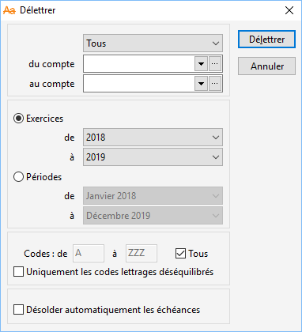

# Délettrage

Le délettrage permet d’annuler un précédent [lettrage](../1/Introduction.md) 
 d’écriture.

 

 

Cette opération peut s’appliquer sur :

* une sélection de 
 comptes (Tous, Clients, Fournisseurs, fourchette à définir),
* pour une période 
 donnée,
* toutes les écritures 
 ou seulement celles dont le code lettrage est compris dans une fourchette 
 de codes,
* uniquement les 
 codes lettrages déséquilibrés.

 

