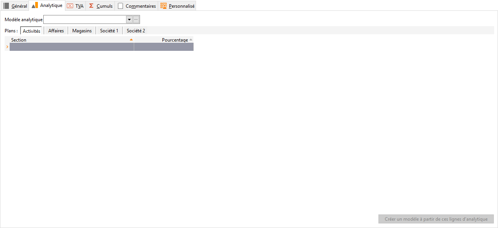

# Analytique

L’onglet Répartition est accessible uniquement si la saisie analytique est activée en Possible ou Obligatoire dans l’onglet Général et permet de paramétrer une répartition automatique pour chaque plan.

 

Cette répartition permettra la ventilation automatique du montant de l’écriture sur chacune des sections de la répartition.

 

Le total du pourcentage de répartition doit être de 100% obligatoirement.

 

 

La liste des sections s’obtient suivant le fonctionnement de la liste déroulante.

 

Si aucune répartition n’est indiquée, la ventilation pourra être effectuée manuellement en saisie d’écritures à partir du bouton Analytique.

