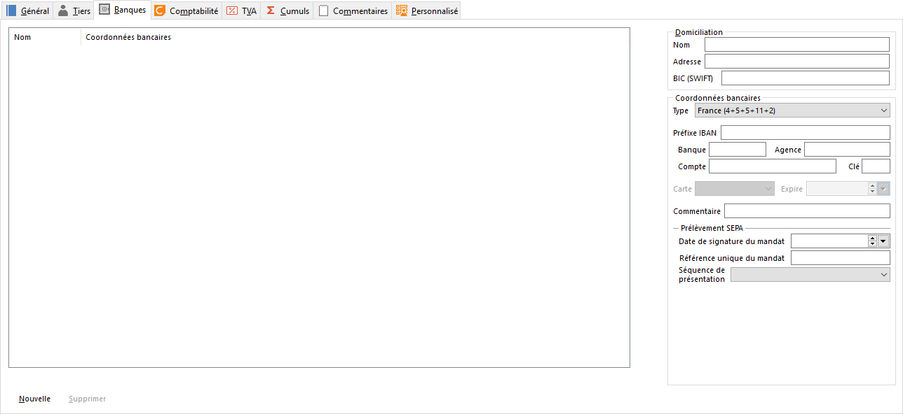

# Banques

Pour la gestion commerciale, ces informations sont disponibles dans les fiches tiers.

 

 

Plusieurs comptes de banques peuvent être enregistrés pour un même tiers avec le bouton Nouveau.

## Domiciliation

Saisir ici les coordonnées de la banque du compte (Nom, Adresse, Swift).

## Type de compte

Plusieurs types de compte peuvent être renseignés : compte bancaire, compte postal, compte suisse (LSV, DTA), compte marocain, …).

## Banque, Agence, Numéro de compte, Clé, IBAN

Permet d’enregistrer le RIB du compte.

## Carte et Date d’expiration

Accessible uniquement lorsque le compte est de type Carte Bancaire.

Les catégories de carte bancaires sont à définir dans les tables de la société (Master Card, Visa, …).

