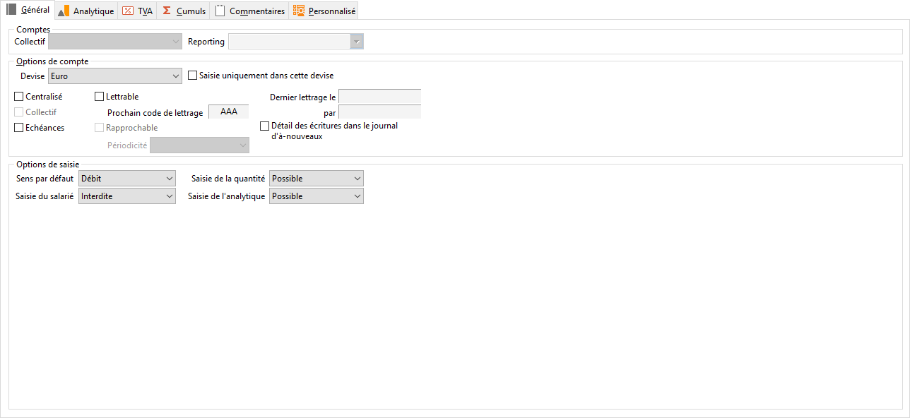

# Général

L’onglet général de la fiche compte permet de paramétrer les options 
 principales du compte. Cet onglet est identique en gestion et en comptabilité.

 

## Collectif (comptes)

La sélection d’un compte collectif peut s’effectuer uniquement sur les 
 comptes de type auxiliaire.

## Reporting (comptes)

La sélection d’un compte de reporting permet d’avoir l’édition d’une 
 comptabilité parallèle. 

## Devise

Un compte est obligatoirement associé à une devise (par défaut la devise 
 société).

 

Pour un compte auxiliaire, le logiciel reprend automatiquement la devise 
 associée au pays saisi dans l’adresse du tiers. Cette devise peut être 
 rendue exclusive en interdisant la saisie en tout autre devise.

 

Important ! ! Pour 
 réaliser un rapprochement bancaire sur un compte en devise, vous devez 
 obligatoirement rendre la devise 
 exclusive. Autrement, le rapprochement s’effectuera en devise de la société. 
 

## Centralisé

Les écritures d’un compte centralisé sont réunies en une seule écriture 
 par journal et par mois en impression du journal ou du grand-livre, et 
 en visualisation de l'extrait de compte. 

## Collectif (option)

Accessible uniquement si le compte est de type Général. A cocher pour 
 indiquer que ce compte est un Collectif.

## Gestion des échéances

Permet d’enregistrer des échéances sur ce compte en saisie d’écritures 
 sur un journal permettant la saisie d’échéance.

## En sommeil

Ce compte n’apparaîtra pas dans les listes.

## Lettrable

Cette option permet d’autoriser ou non le lettrage sur le compte.

 

Le prochain code de lettrage n’est pas paramétrable. Le code lettrage 
 est initialisé à AAA lors de la 
 création du compte.

 

Dès qu’un lettrage est réalisé, l’option "Lettrable" est grisée.

 

Suite à un délettrage, si aucune écriture lettrée n’est présente sur 
 le compte, le prochain code lettrage est remis à AAA et il est possible 
 de décocher la case Lettrable. 

## Rapprochable (bancaire)

Le compte peut-être pointé lors d’un rapprochement bancaire.

La périodicité détermine la cadence des rapprochements bancaires.

## Saisie autorisée

Ces options sont disponibles uniquement si vous les avez activées dans 
 le paramétrage de la société (Menu SOCIETE/Paramétrage).

 

Elles permettent de rendre la saisie de l’analytique et la saisie des 
 quantités obligatoire, possible ou interdite.

* Saisie de l’analytique

1. Possible : 
 la saisie analytique est facultative,
2. Obligatoire : 
 le logiciel refusera de valider l’écriture tant que la ventilation analytique 
 n’aura pas été effectuée sur tous les plans de type Obligatoire.

* Saisie de salarié

Lorsque vous rendez la saisie du salarié 
 possible (par défaut, elle est interdite), 
 vous pouvez saisir celui-ci en saisie standard, saisie guidée ou saisie 
 au kilomètre.

## Sens par défaut

Permet de pré-positionner le curseur dans la colonne Débit ou Crédit 
 en saisie d’écritures.

## Détail des écritures dans le journal d'A nouveaux

Cette option permet de définir les comptes (autres que les comptes de 
 charges et de produits, les comptes lettrables, les comptes rapprochables, 
 les comptes centralisés) dont les écritures vont être détaillées lors 
 de la clôture, si le solde est non nul.

 

Elle sera utilisée dans la 3nde fenêtre de la clôture annuelle (par 
 défaut en fonction de cette option).

