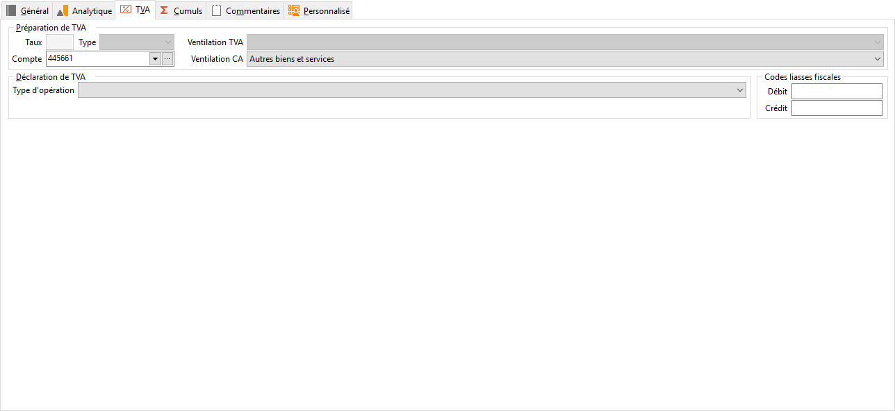

# TVA

Cet onglet permet de renseigner les informations particulières pour gérer ce compte.

 

## PRÉPARATION DE TVA ET DÉCLARATION DE TVA

### Pour un compte de TVA

Saisissez obligatoirement le taux et le type de la TVA que vous souhaitez enregistrer sur ce compte dans l’onglet Informations.

 

Types de TVA disponible :

* Débit
* Collectées
* Décaissées [Cette option n’est pas disponible actuellement]
* Encaissements

Rappel ! La gestion de la TVA sur Encaissements doit être activée dans les paramètres société de votre dossier.

* Import
* Export
* UE (Ventes)
* UE (Achats)

 

De plus, si vous souhaitez calculer un état préparatoire à la déclaration de TVA, sélectionnez dans Ventilation TVA, le code Ventilation (à définir dans les tables) correspondant au code ventilation qui se trouve sur votre déclaration de TVA (Ex : 08 TVA 20 %).

### Pour un compte de charges ou de produits

Pour vérifier les montants de TVA à partir de la base HT, sélectionnez dans la zone Ventilation CA (chiffre d’affaires), le code Ventilation correspondant à la base HT (à définir dans les tables de votre dossier).

 

Le compte de TVA indiqué permet de récupérer le taux associé pour calculer le montant de TVA en fonction du montant HT du compte.

## CODES LIASSE

[Cette option n’est pas disponible actuellement]

