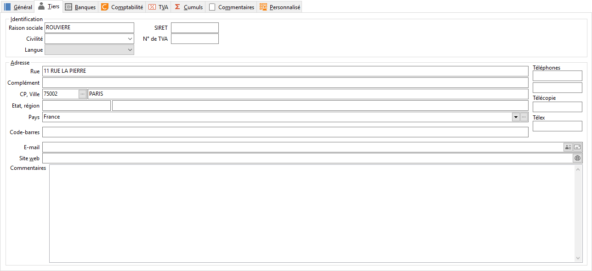

# Tiers

L’onglet Tiers est accessible uniquement pour les comptes de type "Auxiliaire".

 

## Code tiers

En codification automatique du tiers (voir les préférences), le code tiers est calculé automatiquement à partir du numéro de compte saisi. Il correspond aux caractères suivant la racine du compte. Autrement, le code Tiers est accessible et peut être paramétré comme vous le souhaitez.

## Raison sociale et civilité

Une fois le tiers reconnu par son code, vous avez la possibilité de saisir une raison sociale différente de l’intitulé du compte. C’est cette raison sociale qui sera présente sur tous les documents référençant ce tiers. La saisie des caractéristiques spécifiques du tiers va permettre de l’identifier administrativement, géographiquement et de le classifier (civilité, adresse, …).

## Mode de règlement

Le mode de règlement permet de calculer une date d’échéance par défaut en saisie d’écritures.

## Seuil de relance

Permet d’effectuer des relances en fonction de ce seuil.

## Coordonnées

La saisie du pays propose automatiquement de mettre à jour la devise du client dans l’onglet Général par rapport à la devise paramétrée dans la fiche pays.

