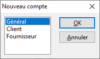

# Sélection du type de compte

Le type de compte à créer est à choisir par exemple lorsqu'on cherche 
 à créer un compte depuis la liste déroulante des comptes, via raccourci 
 clavier Ins, si la liste affiche 
 plusieurs types de comptes.

 

