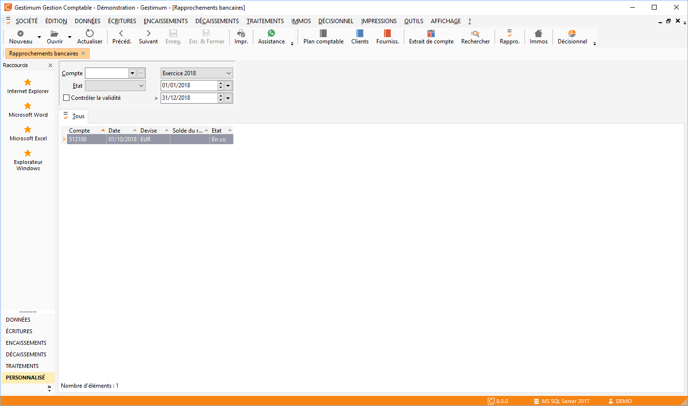

# Liste des rapprochements bancaires

La liste des rapprochements vous permet de visualiser les rapprochements 
 "Validés" ou "En cours" par compte pour une 
 période donnée.

 

Toutes les listes ont un fonctionnement commun (voir Utilisation des 
 listes).

## Sélection du compte

Les comptes proposés dans la liste déroulante sont ceux dont l’option 
 "Rapprochable" est sélectionnée sur la fiche compte.

## Devise de rapprochement

La devise du rapprochement bancaire est automatiquement la devise du 
 compte. Si celle-ci est différente de la devise société, elle doit-être 
 exclusive (saisie uniquement dans cette devise) sinon le rapprochement 
 s’effectuera en devise société.

## État du rapprochement

Il peut-être En cours (A) ou Validé (T).

## Contrôle de la validité

Cette option permet de distinguer les rapprochements "En cours" 
 ou "Validés" déséquilibrés.

 

La ligne du rapprochement est alors en couleur "Erreur" sélectionnée 
 dans les styles des paramètres de la société.

 

Pour [créer 
 un rapprochement bancaire](../4/CreationRapprochementBancaire.md) ou [ouvrir 
 un existant](../4/CreationRapprochementBancaire.md), vous avez les possibilités suivantes :

* Double clique dans 
 la liste,
* Sélection des menus 
 ouvrir la fiche/nouvelle fiche par le menu contextuel,
* Clique sur les 
 icônes Nouveau et Ouvrir de la barre d’outils.

## Menu contextuel

Le menu contextuel propose :

* Toutes les options 
 de bases,
* [Valider 
 le rapprochement bancaire](../4/ValidationRapprochementBancaire.md),
* [Dévalider 
 le rapprochement bancaire](../4/ValidationRapprochementBancaire.md),
* [Valider 
 jusqu'au rapprochement bancaire](../4/ValidationRapprochementBancaire.md),
* [Dévalider 
 à partir du rapprochement bancaire](../4/ValidationRapprochementBancaire.md),
* Toutes les fonctions 
 générales d'une grille.

 

