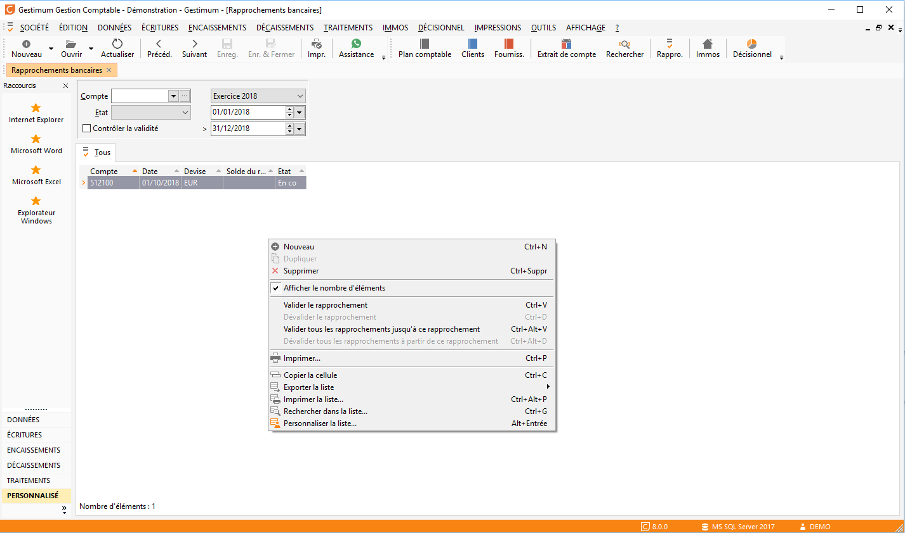

Le rapprochement bancaire de A à Z

Le "rapprochement bancaire" permet de pointer dans votre comptabilité, 
 les mouvements enregistrés sur vos relevés de compte transmis par la banque.

## Informations sur les rapprochements bancaires

Les rapprochements sont regroupés pour chaque 
 compte dans la liste des rapprochements (Traitements/Rapprochement Bancaire).

 

Les rapprochements bancaires d’un même exercice 
 sont dépendants les uns des autres.

 

La date du relevé précédent est la date d’arrêté, 
 et le solde est reporté en relevé précédent.

 

Un rapprochement ne peut pas être validé avant 
 le rapprochement qui le précède.

 

Un rapprochement ne peut pas être dévalidé si 
 le rapprochement suivant est validé.

 

Une fois qu’un rapprochement est validé, tous 
 les rapprochements de l’exercice qui le précèdent ne sont plus modifiables.

 

Pour pouvoir modifier un rapprochement, il faut 
 dévalider tous les rapprochements ultérieurs validés.

 

Les lignes d’écriture "rapprochées" 
 ne peuvent plus être modifiées. Pour les modifier, il faut dérapprocher 
 l’écriture et pour cela il ne faut pas que le rapprochement soit dans 
 l’état validé.

 

Le rapprochement bancaire se déroule en trois 
 étapes :

* Création du rapprochement,
* Rapprochement des 
 écritures et modification éventuelle des dates d’opérations et de 
 valeur,
* Validation du rapprochement 
 ou ajournement.

 

Vous pouvez à tout moment consulter ou imprimer un rapprochement bancaire 
 "En cours" ou "Validé".

## Liste des rapprochements

La liste des rapprochements vous permet de visualiser 
 les rapprochements "Validés" ou "En cours" par compte 
 pour une période donnée.

 

Menu Contextuel de la liste des rapprochements 
 bancaires (clic droit)

* Toutes les options 
 de bases,
* Valider le rapprochement 
 bancaire,
* Dévalider le rapprochement 
 bancaire,
* Valider jusqu'au 
 rapprochement bancaire : Permet la validation d’un ensemble de rapprochements 
 jusqu’à celui qui est sélectionné,
* Dévalider à partir 
 du rapprochement bancaire : Permet la dévalidation des rapprochements 
 à partir de celui qui est sélectionné,
* Toutes les fonctions 
 générales d'une grille.

 

### Sélection du compte

Les comptes proposés dans la liste déroulante sont ceux dont l’option 
 "Rapprochable" est sélectionnée sur la fiche compte.

### Devise de rapprochement

La devise du rapprochement bancaire est automatiquement la devise du 
 compte. Si celle-ci est différente de la devise société, elle doit-être 
 exclusive (saisie uniquement dans cette devise) sinon le rapprochement 
 s’effectuera en devise société.

### État du rapprochement

Il peut être "En cours" ou "Validé".

### Contrôle de la validité

Cette option permet de distinguer les rapprochements "En cours" 
 ou "Validés" déséquilibrés.

 

La ligne du rapprochement est alors en couleur "Erreur" sélectionnée 
 dans les styles des paramètres de la société.

 

Pour créer un rapprochement bancaire ou ouvrir un existant, vous avez 
 les possibilités suivantes :

* Double clique dans 
 la liste,
* Sélection des menus 
 ouvrir la fiche/nouvelle fiche par le menu contextuel, clique sur 
 les icônes
* Nouveau et Ouvrir 
 de la barre d’outils

## Création / ouverture du rapprochement bancaire

Si un relevé antérieur a été enregistré, le logiciel affiche automatiquement 
 sa date et le solde précédent.

 

Si c’est le premier rapprochement bancaire que vous effectuez sur le 
 compte, indiquez la date du Relevé et son solde (A) ainsi que la date 
 du relevé Précédent et son solde (E). 

 

Un rapprochement est déterminé par son compte 
 et sa date de relevé ainsi que le solde du relevé (reçu) (A).

 

Différentes informations vous permettent de 
 suivre l’évolution de votre rapprochement par rapport à votre compte : 
 

* Solde comptable 
 du compte à rapprocher (B),
* Solde des écritures 
 à rapprocher (C = B - A),
* Solde des écritures 
 non rapprochées (D),
* Écart de solde 
 (C - D).

 

La date et le solde (E) sont à saisir uniquement 
 lors du premier rapprochement. Ces informations seront mises à jour à 
 la validation du premier rapprochement et seront disponibles automatiquement 
 à l’ouverture du rapprochement suivant

 

Différentes informations vous permettent de 
 suivre l’évolution de votre rapprochement par rapport à votre relevé bancaire 
 : 

* Solde des écritures 
 à rapprocher (F = A - E),
* Solde des écritures 
 rapprochées (G),
* Écart de solde 
 (F - G).

 

Si vous saisissez une date d’opération, une 
 date de valeur et/ou un code pointage, le logiciel intégrera automatiquement 
 ces informations aux lignes rapprochées

 

Le code relevé est facultatif. Il sera attribué 
 aux Écriture rapprochées. La date d’opération (Dt Opér) et la date de 
 valeur (Dt Valeur) doit obligatoirement être compris entre la date du 
 relevé précédent et la date du relevé reçu.

 

Une fois ce paramétrage effectué, vous pouvez commencer à rapprocher 
 vos Écriture

## Premier rapprochement bancaire

La saisie du premier rapprochement bancaire est importante. Elle détermine 
 la cohérence de votre compte de banque pour les rapprochements futurs.

### Saisie des Écritures non rapprochées en N

Vous devez saisir les points suivants dans le journal des A-nouveaux 
 (journal de type OD paramétré dans les préférences de la comptabilité) 
 de l’exercice courant (N) :

* Le détail des Écritures 
 de trésorerie à rapprocher
* Le solde des comptes 
 de trésorerie du dernier relevé reçu et rapproché

### Création du premier rapprochement

Vous devez saisir la date et le solde (E) du relevé précédent, ensuite 
 sélectionnez la ligne du solde rapproché saisi en A-Nouveaux, et par un 
 clic droit menu contextuel choisissez l’option "rapprocher au solde 
 précédent".

 

Ensuite, saisissez la date et le solde du relevé reçu (A) et commencez 
 votre rapprochement bancaire.

 

Enfin, validez le rapprochement, lorsqu’aucun solde ne subsiste.

## Rapprochement des écritures

Une ligne d’écriture est composée 

* d’une date d’opération,
* d’un libellé,
* d’un numéro 
 de pièce,
* d’une date de 
 valeur,
* d’un montant 
 Débit ou Crédit,
* d’une date de 
 relevé,
* d’un code relevé,
* d’une date de 
 saisie d’écriture,
* d’un code journal,
* d’un libellé 
 automatique,
* d’un numéro 
 de ligne de l’écriture.

 

Les lignes peuvent être triées par date d’opération, montant, date de 
 saisie de l’écriture, code journal.

 

Vous pouvez afficher toutes les Écritures, les Écritures rapprochées 
 ou les écritures non rapprochées (par l’option de sélection en bas de 
 la grille).

### Menu contextuel (clic droit)

* Sélectionner une 
 ligne,
* Désélectionner 
 une ligne,
* Tout sélectionner 
 : sélectionner toutes les lignes
* Tout désélectionner 
 : désélectionner toutes les lignes,
* Rapprocher l’écriture 
 au solde précédent (cas du 1er rapprochement bancaire),
* Afficher les écritures 
 du compte "Dans le sens de la banque" : Cette option permet 
 d’inverser les colonnes Débit et Crédit des Écritures.

 

Les montants dans la partie gauche du rapprochement ne sont pas touchés 
 par cette option

* Accéder à la saisie 
 standard,
* Imprimer le rapprochement

### Date d’opération

La date d’opération correspond par défaut à la date de saisie de l’écriture. 
 Si vous souhaitez faire correspondre votre rapprochement avec votre relevé, 
 vous pouvez indiquer la date d'opération du relevé qui sera prise en compte 
 dans la grille lors du pointage.

### Montant

Le sens du montant de l’écriture dépend du choix effectué dans le menu 
 contextuel "Dans le sens de la banque".

### Pointage des écritures à rapprocher

Le logiciel calcule automatiquement le solde des Écritures à rapprocher 
 par différence entre le solde du relevé reçu et le solde du relevé précédent

Le rapprochement s’effectue ligne par ligne par un double-clic ou par 
 le menu contextuel.

 

Une ligne rapprochée apparaît dans une couleur différente paramétrée 
 dans les styles de la société et intègre éventuellement le code relevé, 
 la date d’opération et/ou la date de valeur.

 

A chaque pointage ou dépointage, le logiciel met à jour les soldes.

 

Lorsque vous avez terminé de rapprocher les écritures, vous devez ajourner 
 ou valider votre rapprochement.

## Validation du rapprochement

Tant que le solde du rapprochement n’est pas nul, le rapprochement ne 
 peut être "Validé" mais vous pouvez l’enregistrer pour le terminer 
 plus tard. Il sera alors en état "En cours".

### Validation du rapprochement

Lorsque le solde de votre rapprochement devient nul, le rapprochement 
 peut être validé (le bouton "Valider le rapprochement" est actif).

 

Vous pouvez également valider le rapprochement depuis le menu contextuel 
 de la liste des rapprochements bancaires.

 

De même, vous pouvez valider un ensemble de rapprochements.

 

Les écritures pointées sont alors définitivement rapprochées.

### Dévalidation du Rapprochement

Lorsque vous souhaitez modifier un rapprochement bancaire "Validé", 
 vous devez "Dévalider" celui-ci. Pour cela, vous devez :

* Soit ouvrir le 
 rapprochement bancaire puis cliquez sur le bouton "Dévalider 
 le rapprochement",
* Soit sélectionner 
 l’option "Dévalider le rapprochement" depuis le menu contextuel 
 de la liste.

 

Ensuite, vous pouvez dé-rapprocher ou rapprocher les écritures que vous 
 souhaitez.

### Attention

Vous ne pouvez dévalider un rapprochement bancaire que si le rapprochement 
 suivant n’est pas validé. Si ce n’est pas le cas, vous devez dévalider 
 le rapprochement suivant ainsi que les autres qui ont une date de relevé 
 supérieure à celui que vous souhaitez modifier.

 

Pour cela vous 2 possibilités :

* Aller sur chaque 
 fiche et demander de dévalider le rapprochement en partant du dernier 
 validé,
* Sélectionner l’option 
 "Dévalider à partir du rapprochement" à partir du menu contextuel 
 de la liste.

## Premier rapprochement bancaire suite à la clôture

Lors de la clôture, le solde des écritures "rapprochées" des 
 comptes marqués "A rapprocher" de l’exercice précédent, est 
 reportée en A-Nouveau en une seule ligne.

 

Elle correspond normalement au montant du dernier relevé et pourra être 
 associée au solde du relevé précédent. Les lignes des écritures "non 
 rapprochées" sont reportées individuellement et pourront être associées 
 avec des lignes du relevé de l’exercice.

