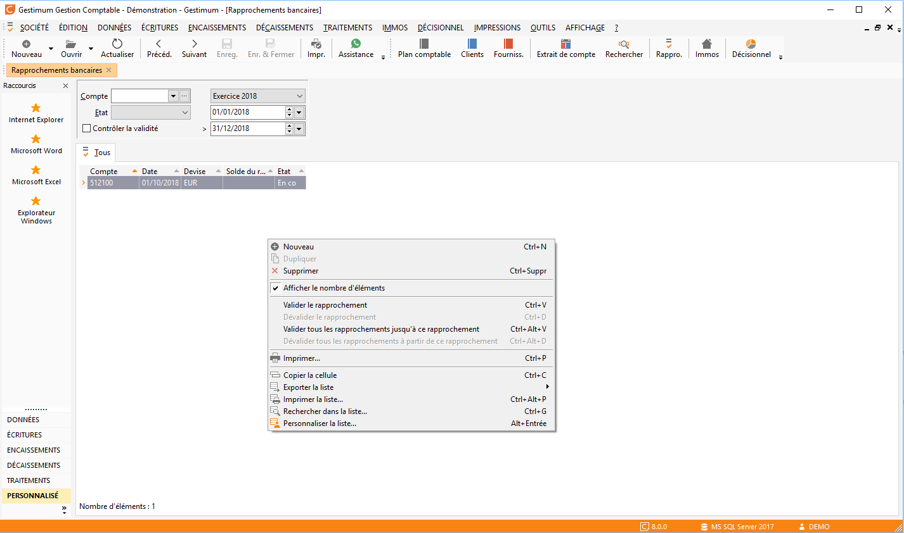
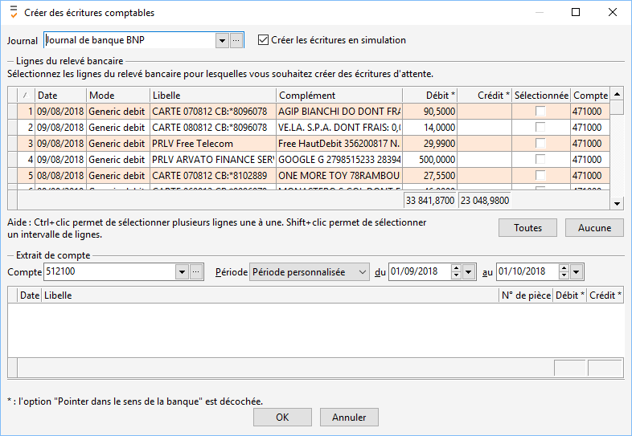

Import de relevés de banque

 /\*<![CDATA[\*/
 A:visited {
 color: #800080;
 }
 A:link {
 color: #0000ff;
 }
 /\*]]>\*/
 

A partir de la version 4. 8 de Gestimum Gestion Comptable, il est possible d’importer les écritures de trésorerie puis de réaliser le rapprochement bancaire automatiquement.

## Import de fichiers de relevés de banque

Ouvrir le menu TRAITEMENTS puis cliquer sur Rapprochements bancaires.

 

Faire clic droit "Nouveau" afin de réaliser un nouveau rapprochement :

 

 

Renseignez votre "date du relevé", votre "solde du relevé" puis votre "code relevé" (facultatif) en bas.

 

Ensuite, cliquez sur «Importer un relevé bancaire» via le menu contextuel (clic droit), Gestimum vous propose différents formats (consulter votre banque pour plus d’informations) pour importer vos relevés.

 

Pour l’exemple nous allons importer un fichier au [format OFX](FormatOFX.md) :

* Sélectionnez le fichier à importer,

* Une fois le fichier de votre banque téléchargé, il suffit de l’importer puis cliquez sur «Créer des écritures comptables» en bas à droite afin de créer les écritures sur votre journal de banque.

## Création d'écritures

 Une nouvelle fenêtre s’ouvre afin de créer ces écritures.  

Vous pouvez sélectionner plusieurs lignes une à une en cochant la colonne "Sélectionnée", ou bien tout sélectionner en cliquant sur le bouton "Toutes".

 

Choisissez votre journal de création.

 

Modifiez vos comptes d’attente si vous souhaitez puis cliquez sur "OK". Les comptes d’attente sont personnalisables dans le menu "Fichier | Paramétrage | Préférences".

 

Vous pouvez visualiser avant import les écritures déjà présentes dans votre comptabilité dans la partie "Extrait de compte".

 

 

 

Vos écritures sont créées. Ces écritures seront générées en mode "Simulation". Il vous faudra les valider ensuite via le menu "Outils | Traiter les écritures en simulation".

 

Une fois vos comptes modifiés (remplacement des comptes d’attente par les comptes de tiers, de charges, de produits ou de bilan si vous ne l’avez pas fait avant l’import), vous pouvez rapprocher votre relevé avec les écritures comptables.

 

Dans les versions suivantes de Gestimum ERP nous intégrerons une bibliothèque de liens permettant d’associer un libellé avec le compte adéquat sans passer par les comptes d’attente.

 

Sur votre "Nouveau rapprochement bancaire", les informations se sont importées également.

