Rapprochement bancaire automatique

 /\*<![CDATA[\*/
 A:visited {
 color: #800080;
 }
 A:link {
 color: #0000ff;
 }
 /\*]]>\*/
 

## Pointage par date, montant, numéro de pièce, champ personnalisé

Sur votre "Nouveau rapprochement bancaire", veuillez "Importer votre relevé bancaire".

 

Sélectionnez votre fichier à importer.

 

Puis cliquez sur "Pointer avec les écritures comptables".

 

Vous avez toujours la possibilité de pointer manuellement en cliquant sur "Pointer" en bas à gauche sinon cliquez sur "Pointer automatiquement".

 

Gestimum Comptabilité vous propose 4 critères combinatoires de pointage : date, montant, N° de pièce de la ligne d’écriture, champ personnalisé.

 

Puis faites "OK".

 

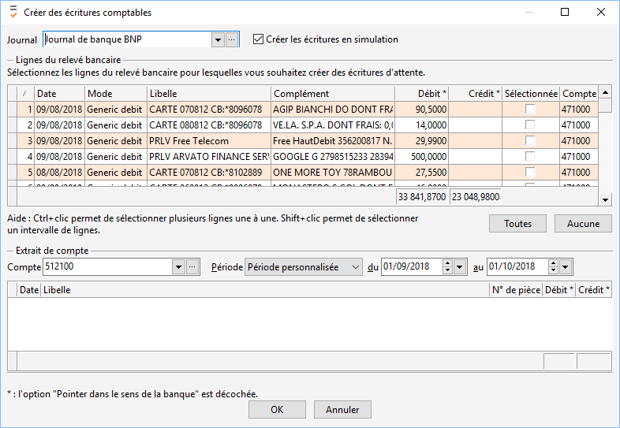

 

Le logiciel pointera automatiquement en indiquant les codes de pointage (voir les couleurs) puis cliquez 2 fois **"OK"** pour retourner sur votre rapprochement bancaire.

 

Sur votre rapprochement bancaire les écritures rapprochées seront en bleu ciel et pour terminer cliquez sur "valider le rapprochement" en bas.

 

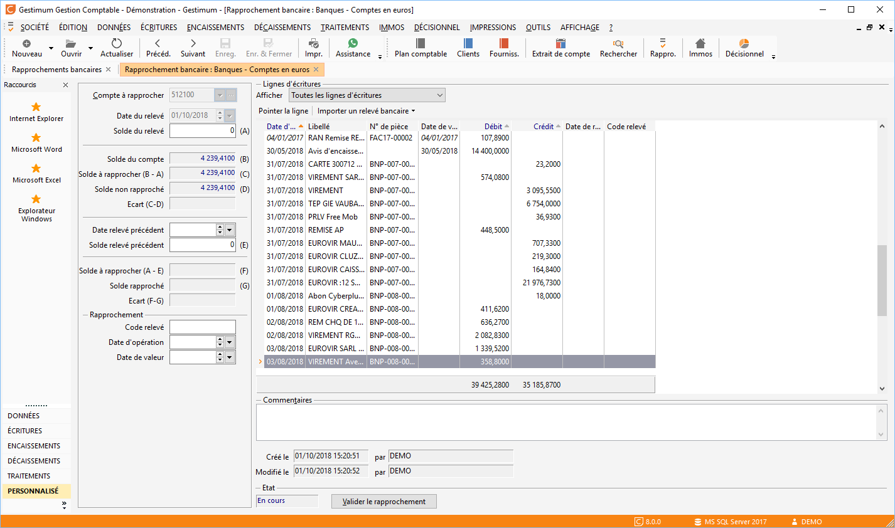

## Pointage en fonction de champs personnalisés

Si dans vos écritures vous avez créé des champs personnalisés, vous pouvez effectuer un pointage en fonction de ces champs personnalisés.

 

Attention ce champ devra être de type texte.

 

Exemple : une écriture du journal de banque avec champ personnalisé "Code chrono".

 

Un champ personnalisé commence toujours par "XXX\_\*\*\*\*" dans vos propriétés de la grille.

Pour la création d’un champ personnalisé se rapporter à la fiche thématique "La création d’un champ personnalisé".

 

Exemple de fichier à importer avec un champ personnalisé "Code chrono" :

 

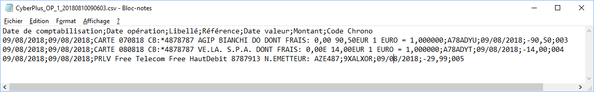

 

Allez dans votre rapprochement bancaire puis cliquez sur "Importer un relevé bancaire" puis sur "Importer un relevé bancaire au format texte délimité".

 

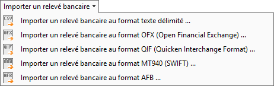

 

Importez votre fichier en le sélectionnant dans votre liste :

 

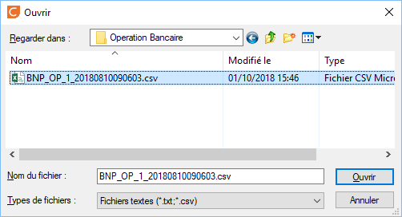

 

Une fois votre fichier importé, il faudra renseigner les champs "Date", "Libellé", "Débit", "Crédit" et "Complément". Dans "Complément" vous mettrez votre champ personnalisé.

 

Si sur votre fichier vous avez importé la 1ere ligne qui contient le nom des champs cochez "Nom des champs en première ligne".

 

Voici la fenêtre avant :

 

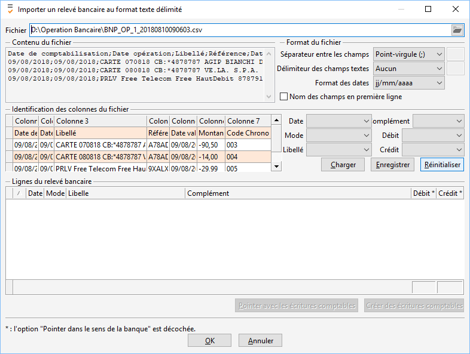

 

Puis la fenêtre après avoir choisi les options, faites "Pointer avec les écritures comptables" ensuite. Vous avez la possibilité de sauvegarder ce paramétrage en cliquant sur "Enregistrer" puis les prochaines fois ou vous ferez votre importation faites "Charger" pour charger ces paramétrages.

 

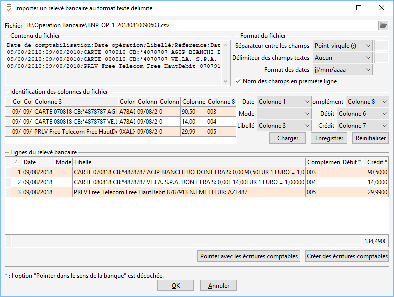

 

Cliquez sur "Pointer automatiquement" :

 

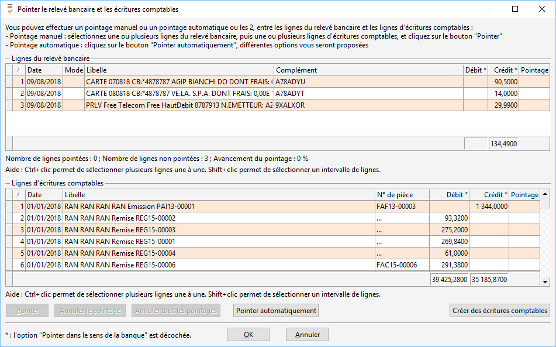

 

Une fenêtre s’ouvre et sélectionnez le pointage par "champ personnalisé".

 

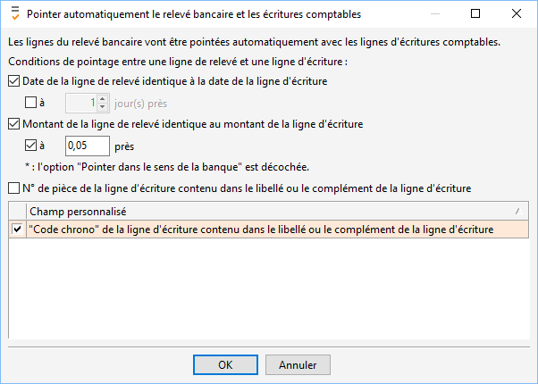

 

Dans cet exemple, en fonction du "Code chrono" le logiciel pointera automatiquement les écritures du relevé et de la comptabilité. Cliquez 2 fois sur "OK" pour retourner à votre rapprochement bancaire.

 

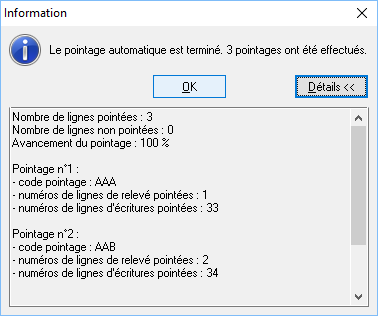

 

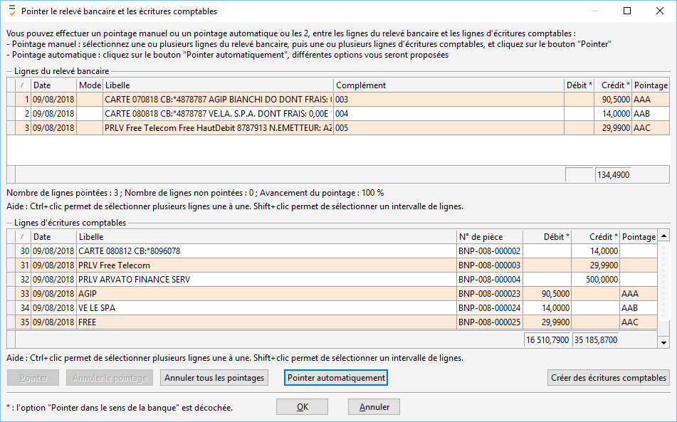

 

Les écritures pointées seront automatiquement misent en bleu ciel.

 

A ce stade, vous pouvez enregistrer votre rapprochement pour le consulter ultérieurement et/ ou le terminer, il vous suffira de cliquer sur "Valider le rapprochement".

 

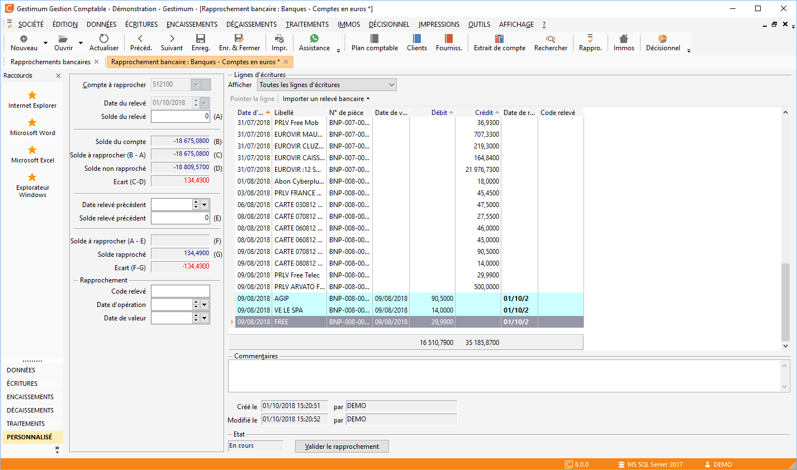

