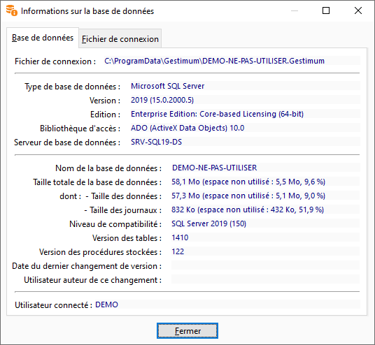
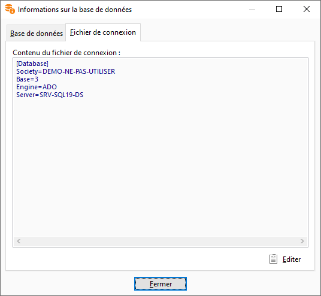

# Informations sur la base de données

Cette fenêtre est accessible par le menu OUTILS.

 

Elle a pour but d’indiquer les informations de connexion à la société.

 

Elle vous indique les informations de connexion à la base de données 
 et la structure du fichier ".Gestimum".

## Base données

 

Cet onglet vous informe sur :

* Le chemin du fichier 
 ".Gestimum"
* Le nom de la société
* La version de la 
 base
* Le type de base 
 données
* Le moteur d'accès 
 à la base de données
* Dossier : Le répertoire 
 ou se situe la base de données
* Le nom du serveur
* Le nom de l’utilisateur 
 connecté

## Fichier de connexion

Cet onglet vous permet de visualiser le contenu du fichier de connexion 
 ".Gestimum".

 

 

Vous pouvez éditer ces informations et ainsi créer un autre fichier 
 ".Gestimum" avec les mêmes informations.

