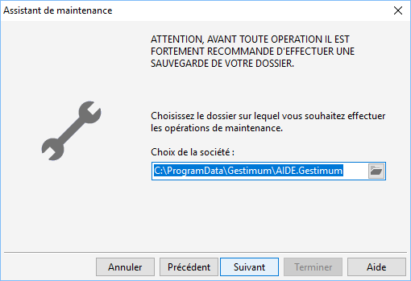
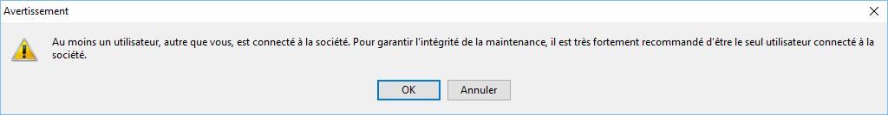
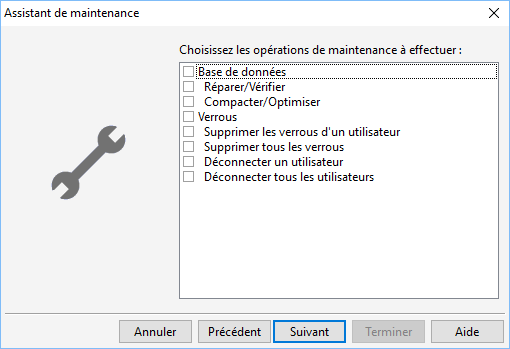

# Maintenance de la base de données

Cet outil accessible lorsque la société est fermée doit être utilisé 
 avec précaution et guidé par le service assistance.

 

Il est fortement de faire une sauvegarde avant de lancer l'outil.

 

Dans un premier temps, vous devez sélectionner la base sur laquelle 
 il faut faire les manipulations.

 

 

Attention, vous aurez 2 fois le message ci-dessous si vous lancez l'outils 
 alors que d'autres utilisateurs sont connectés à la base.

 

 

Cet outils permet d'effectuer les manipulations suivantes sur la base 
 de données :

* Réparer / Vérifier la base en fonction du schéma Gestimum,
* Compacter / Optimiser la base.

 

Cet outils permet aussi d'intervenir sur les connexions des utilisateurs 
 :

* Supprimer les verrous d'un utilisateur (sur les documents, les 
 écritures ...),
* Supprimer tous les verrous,
* Déconnecter un seul utilisateur,
* Déconnecter tous les utilisateurs.

 

