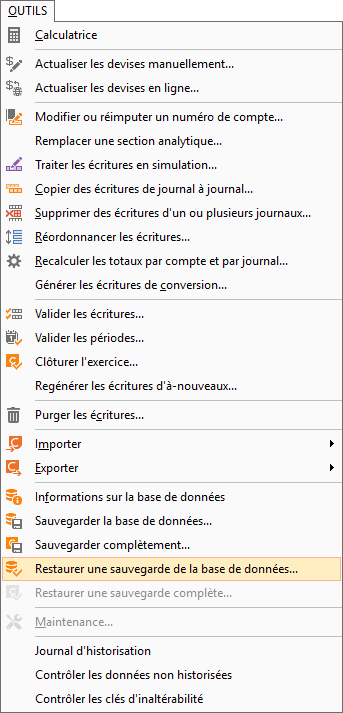
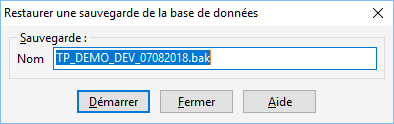

# Restaurer une sauvegarde de la base de données

Cet outils vous permet de restaurer vos données de façon simplifié.

 

Il est accessible par OUTILS | Restaurer 
 une sauvegarde de la base de données.

 

 

Pour les bases Microsoft SQL Server, vous pouvez soit utiliser cette 
 outil, soit utiliser un outil externe, comme Microsoft SQL Server Management 
 Studio.

## Exclusivité

Lors de la restauration, il est obligatoire d’être le seul utilisateur 
 connecté à la société (le traitement vous connectera automatiquement en 
 exclusivité si vous êtes le seul utilisateur).

 

Dans le cas contraire, un message d’erreur vous informe qu’un autre 
 utilisateur est connecté à la société et qu’il est impossible de réaliser 
 la restauration.

## Restauration

Vous devez indiquez le nom du fichier que vous souhaitez restaurer.

 

 

Ce fichier sera recherché par défaut dans le répertoire C:\WinNT\System32.

## Progression

Lorsque vous avez terminé le paramétrage de la restauration, il vous 
 suffit de cliquer sur le bouton "Démarrer" pour lancer le traitement.

 

Un message d’avertissement vous demande de confirmer ou non la restauration.

 

Un autre message d’erreur peut apparaître si vous n’êtes pas le seul 
 utilisateur connecté au dossier.

