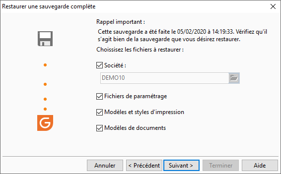

# Sélection des informations à restaurer

Ensuite, vous devez sélectionner les informations que vous désirez restaurer 
 :

* Inclure le dossier 
 : restauration de la base de données
* Informations de 
 configuration et environnement de travail
* Paramètres, modèles 
 et styles d'impression

 

