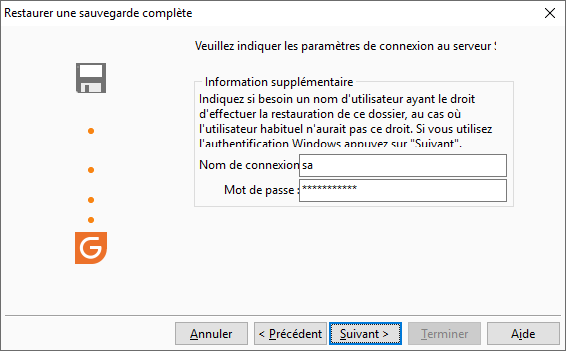

# Sélection des paramètres de connexion au serveur

Dans le cas où l’utilisateur habituel n’aurait pas le droit de restaurer 
 le dossier sur le serveur SQL, vous devez indiquer :

* Un nom de connexion au serveur 
 : Nom de l’utilisateur ayant le droit de sauvegarder sur le serveur,
* Un mot de passe : Mot de passe 
 de l’utilisateur saisi dans le champ précédent.

 

 

Suite à la sélection de ces paramètres, cliquez sur le bouton "Suivant" 
 puis "Terminer" pour lancer la restauration.

