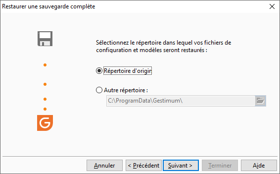

# Sélection du répertoire des fichiers autres

Vous aurez cet écran uniquement si vous restaurez les informations autres que la base de données, c’est à dire les informations suivantes :

* Informations de configuration et environnement de travail,
* Paramètres, modèles et styles d'impression.

 

Vous avez le choix entre :

* La restauration des informations dans le répertoire d’origine : celui-ci sera automatiquement proposé
* La restauration des information dans un autre répertoire : c’est à vous de le sélectionner

 

