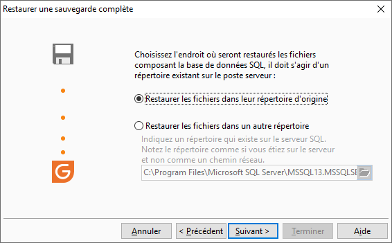

# Sélection du répertoire de restauration de la base de données

Dans cet écran, vous devez désigner l’endroit où seront restaurés les 
 fichiers composant la base de données SQL. Le répertoire doit exister 
 sur le serveur.

 

 

Vous avez le choix entre :

* Le répertoire d’origine 
 : Celui-ci sera automatiquement proposé,
* Un autre répertoire 
 : C’est à vous de le saisir (vous devez indiquer le chemin du répertoire 
 comme si vous étiez sur le serveur et non pas comme un chemin réseau).

 

Par exemple : C:\Sauvegarde.

 

 

