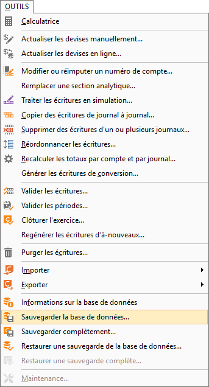
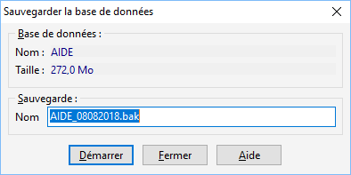

# Sauvegarder la base de données

Avant tout, fermez toutes les fenêtres ouvertes. 

 

Pour accéder à l'outil, il faut aller dans le menu OUTILS 
 | Sauvegarder la base de données.

 

 

Vous pouvez laisser le nom de la sauvegarde 
 par défaut ou la nommer comme vous voulez.

 

 

La sauvegarde sera faite automatiquement sur 
 le serveur, le chemin de la sauvegarde par défaut est généralement : C:\Program 
 Files\Microsoft SQL Server\MSSQL. 1\MSSQL\Backup.

 

Vous avez aussi la possibilité de renseigner 
 un autre chemin avant le nom de la sauvegarde, il faut toutefois faire 
 attention à avoir le droit en écriture dans le dossier cible.

 

Vous pouvez ensuite cliquer sur "Démarrer".

