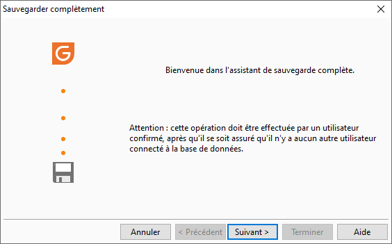

# Bienvenue

L’assistant vous guide dans les différentes étapes du paramétrage de 
 la sauvegarde.

 

 

Sur cet écran, il vous informe :

* que la sauvegarde doit être 
 effectuée par un utilisateur confirmé
* qu’il faut vérifier si aucun 
 utilisateur n’est connecté à la base de données

 

Toutefois, si un utilisateur était connecté à la base de données, un 
 message vous informera qu’au moins une autre personne est connectée à 
 la société et par conséquent la sauvegarde ne peut être réalisée.

