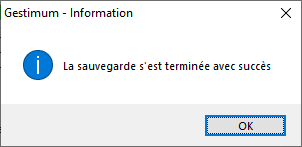

# Progression de la sauvegarde

Suite à la sélection du bouton "Terminer", la sauvegarde se 
 lance.

 

Une barre de progression permet de voir l‘avancement de la sauvegarde 
 et la réalisation du fichier "backup.log".

 

Ce fichier contient les différentes opérations effectuées pendant la 
 sauvegarde.

 

Vous pouvez le consulter à l’endroit où vous avez demandé la sauvegarde 
 (dans le même disque/répertoire que la sauvegarde).

 

A la fin du traitement, un message d’information vous indique que le 
 traitement est terminé. Vous devez valider ce message (cliquer sur le 
 bouton "OK") et cliquer sur le bouton "Fermer" pour 
 sortir de la fenêtre de sauvegarde des données.

 

