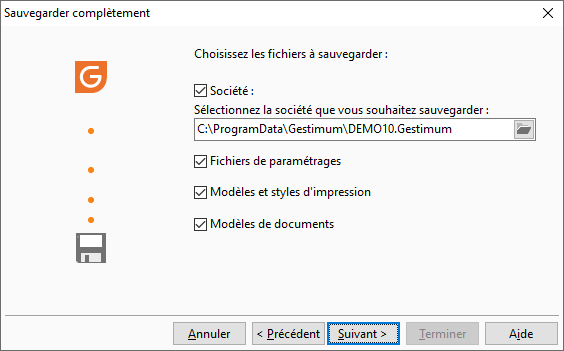

# Sélection des informations à sauvegarder

Dans cet écran, vous devez sélectionner les données que vous souhaitez 
 sauvegarder (dossier, configuration de travail, modèles, styles d’impression 
 …).

 

## Inclure un dossier

La sélection de cette option permet de sauvegarder votre dossier.

 

Pour cela, vous devez sélectionner le chemin du dossier que vous souhaitez 
 sauvegarder.

## Informations de configuration et environnement de travail

Les informations de configuration et l’environnement de travail sont 
 répartis en 3 groupes. Vous n’avez pas la possibilité de sauvegarder/restaurer 
 un groupe en particulier, c’est obligatoirement les 3.

## Fichiers de base

Les fichiers de bases sont les fichiers avec les extensions :

* Gestimum.Barres,
* Gestimum.ini
* Gestimum.Préférences
* Gestimum.Grilles
* Gestimum.Dictionnary

Ces fichiers sont stockés dans le dossier de 
 la session de l'utilisateur Windows, par 
 exemple : C:\Users\Utiliseur1\AppData\Roaming\Gestimum.

## Fichiers de données de base

Les fichiers de données de base sont tous ceux présents dans le répertoire 
 sous la racine de Gestimum, par exemple : C:\Program Files\Gestimum.

 

Vous retrouverez par exemple les fichiers suivants : Devises.txt, Pays.txt, 
 PlanComptable.fr, PlanComptable.mc, 
 Tables.txt, Ville.fr, …

## Rapports d’erreurs

Les fichiers rapports d’erreurs sont des fichiers générés à la fin de 
 traitements particuliers dans le répertoire des fichiers temporaires paramétré 
 dans les préférences utilisateur, par défaut : C:\ProgramData\Gestimum\Temp.

## PARAMÈTRES, MODÈLES ET STYLES D’IMPRESSION

Cette partie permet d’inclure à la sauvegarde les informations qui concernent 
 les impressions de votre dossier :

* Paramètres Infocenter 
 : Cette option permet de sauvegarder le fichier Infocenter. Ini présent 
 dans le répertoire Infocenter/Bin sous la racine de Gestimum,

* Modèles de documents 
 : Cette option permet de sauvegarder les fichiers présents dans le 
 répertoire Documents sous la racine de Gestimum,

* Modèles d’impression 
 : Cette option permet de sauvegarder les fichiers présents dans le 
 répertoire Modeles sous la racine de Gestimum,

* Styles d’impression 
 : Cette option permet de sauvegarder les fichiers présents dans le 
 répertoire Styles sous la racine de Gestimum.

