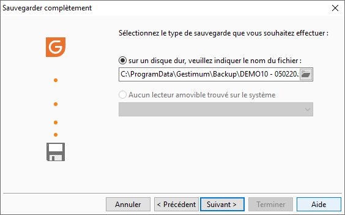

# Sélection du support de sauvegarde

Cet écran permet de sélectionner le type de sauvegarde que vous souhaitez effectuer.

 

Il peut être :

* un support amovible (Clé USB, DVD)
* un disque dur

 

Dans ce cas, vous devez indiquer le répertoire et le nom du fichier de la sauvegarde. Il sera obligatoirement avec l’extension ZIP (\*. zip).

 

 

Suite à la sélection du type de sauvegarder cliquez sur le bouton "Suivant" puis "Terminer" pour lancer la sauvegarde.

