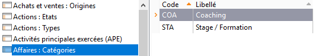
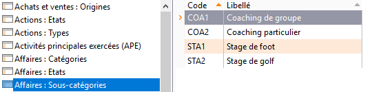
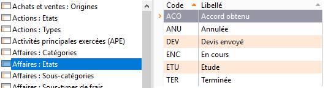
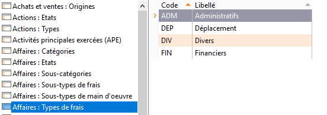
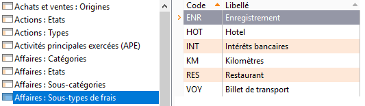
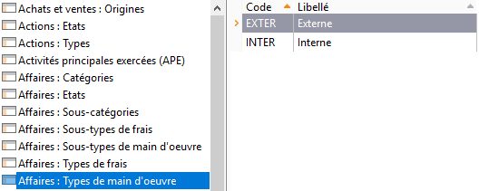
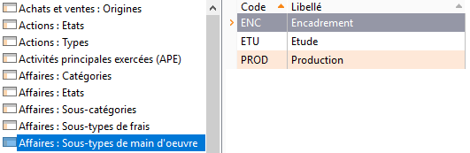
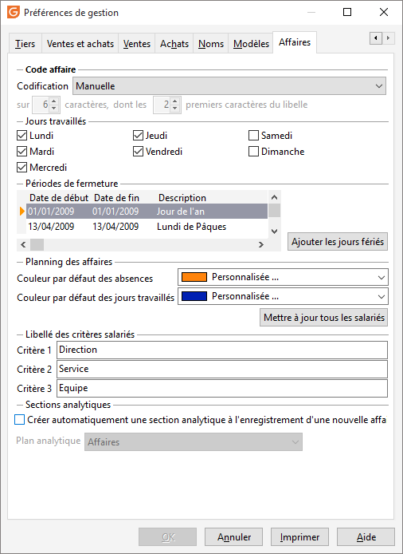
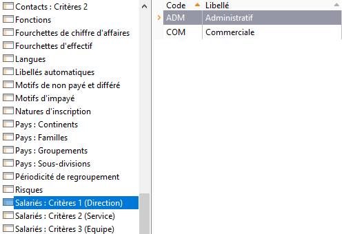
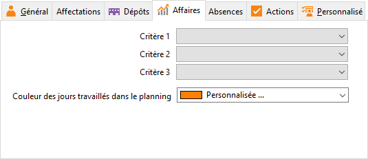

# Paramétrage

Il y a plusieurs éléments à paramétrer pour se servir complètement des 
 affaires :

* les catégories et sous-catégories d'affaires
* l'état des affaires
* les types et sous-types 
 de frais et main d'oeuvre
* les libellés des critères 
 des salariés
* les critères des salariés
* la fiche salarié

## Catégorie et sous-catégorie d'affaire

A partir du menu SOCIÉTÉ | Paramétrage 
 | Tables de références :

### Affaire : Catégories

### Affaire : Sous-catégories

## État des affaires

A partir du menu SOCIÉTÉ | Paramétrage 
 | Tables de références :

 

## Type et sous type de frais et de main d’oeuvre

A partir du menu SOCIÉTÉ | Paramétrage 
 | Tables de références :

### Affaires : Type de frais

Saisir les différents type de frais (Exemple : Déplacement, administratif, 
 etc.)

 

### Affaires : Sous-type de frais

Saisir les différents sous-types de frais (Exemple : Hôtel, Frais kilométriques, 
 taxes locales, royalties, etc.) :

 

### Affaires: Type de Main d’œuvre

Saisir les types de MO (Exemple : Production, Étude, etc.) :

 

### Affaires : Sous-type de Main d’œuvre

Saisir les sous-type de main d’œuvre (Exemple : Cadre, Etam, OS, Sous-traitant, 
 etc.) :

 

## Critères de classification des salariés

Concernant les trois critères de classification supplémentaires et affectables 
 sur la fiche salarié, vous pouvez les labelliser à votre convenance. 

 

Pour cela, il faut les saisir à partir du menu :

 

* Labellisation des 
 titres des critères - A partir du menu Société 
 | Paramétrage | Préférences de gestion, onglet "Affaires"

 

  
  

* Valeurs des critères 
 de classification - A partir du menu SOCIÉTÉ 
 | Paramétrage | Tables de références.

 

Vous pouvez saisir dans les tables de références les valeurs des critères 
 de classification des salariés :

 

* Salariés : Critères 
 1
* Salariés : Critères 
 2
* Salariés : Critères 
 3

 

 

Pour chacune des nouvelles tables de référence, il faut associer un 
 code (15 caractères alphanumériques maximum) et un libellé (60 caractères 
 alphanumériques maximum).

## Fiche salariés

### Affectation des critères aux salariés

A partir du Menu SOCIÉTÉ | Salariés, 
 onglet "Affaires", vous pouvez maintenant affecter vos critères 
 aux fiches salariés :

 

