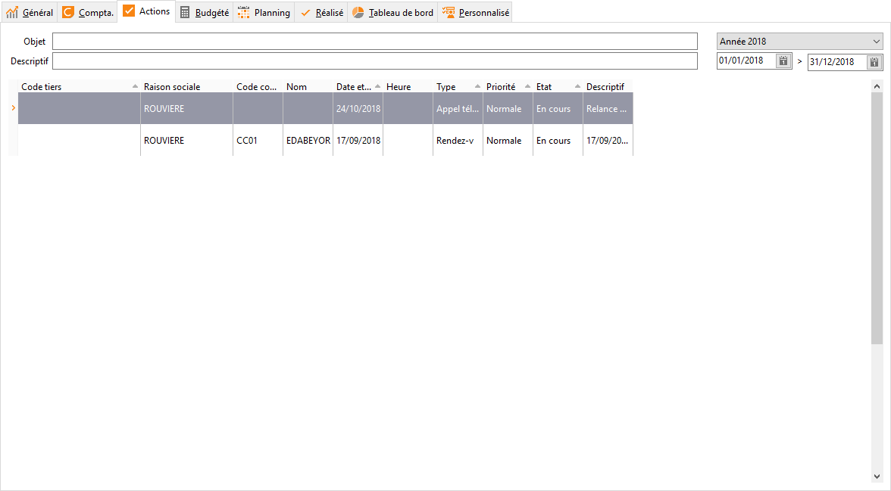

# Actions

Cet onglet permet de visualiser toutes les actions rattachées à l'affaire.

 

On peut filtrer ces actions en fonction de leur objet ou de leur descriptif, 
 il y a également un filtre sur les dates des actions.

 

