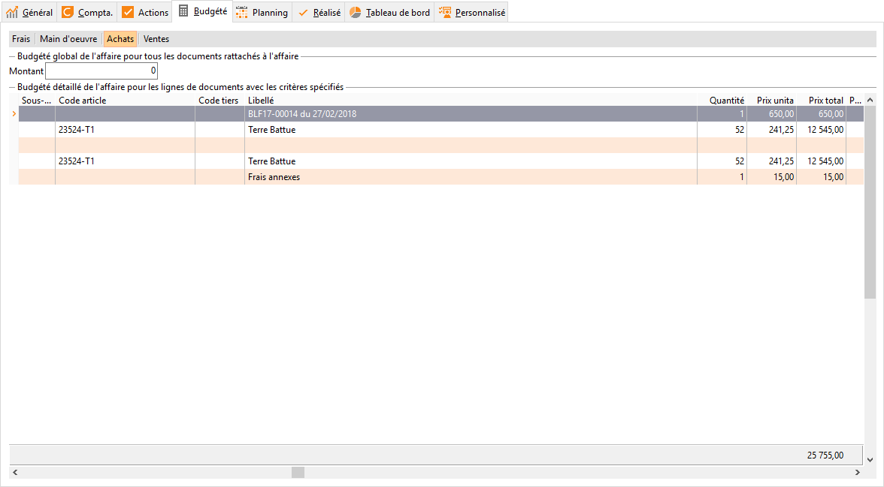
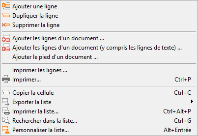
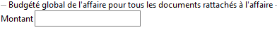
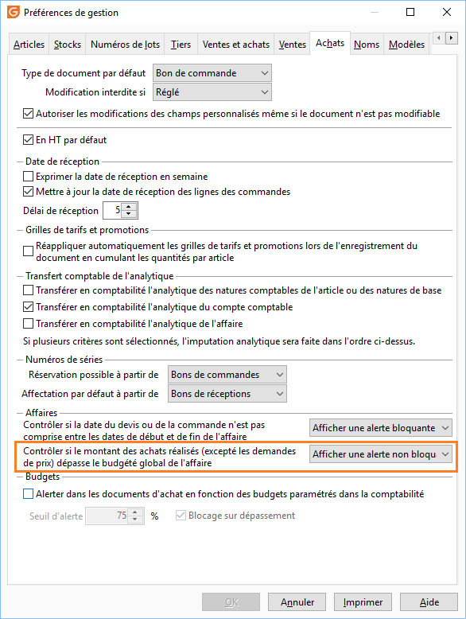

# Achats budgétés

La saisie peut se faire sans alimenter toutes les colonnes famille, sous-famille, code tiers, article, quantité, prix unitaire.

 

 

 

Vous pouvez aussi alimenter les lignes en important celles d'un document ou en important juste le montant total du document.

 

 

La zone "Montant" dans l'entête du sous onglet est utilisé lorsque vous souhaitez avoir un message bloquant ou d'avertissement dans les documents d'achat rattachés à l'affaire.

 

 

Le paramétrage du message se fait dans les préférences de gestion dans l'onglet Achats.

 

