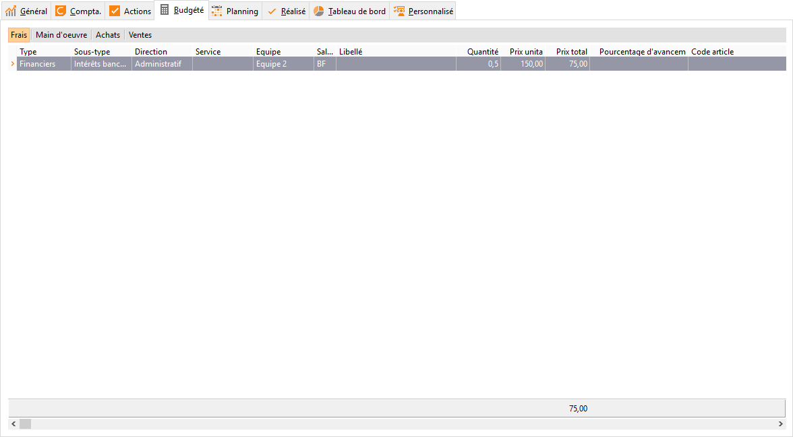

# Frais budgétés

La saisie peut se faire sans alimenter toutes les colonnes type, sous-type, 
 critère 1, critère 2, critère 3, salarié, article, quantité, prix unitaire.

 

 

La saisie d’un article, alimente automatiquement le libellé avec celui 
 de l’article. Seuls les articles de catégorie Autre sont saisissables 
 dans les frais.

 

La saisie d’un salarié alimente automatiquement les 3 critères qui lui 
 ont été affectés dans sa fiche.

