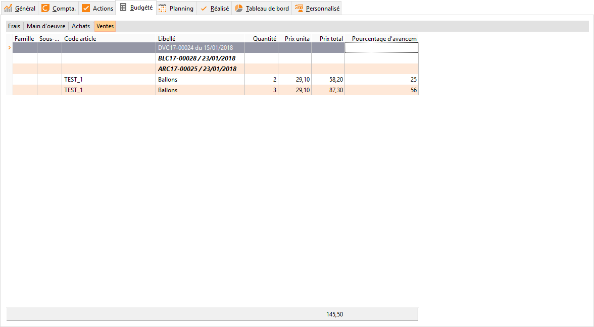
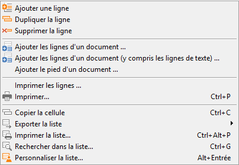
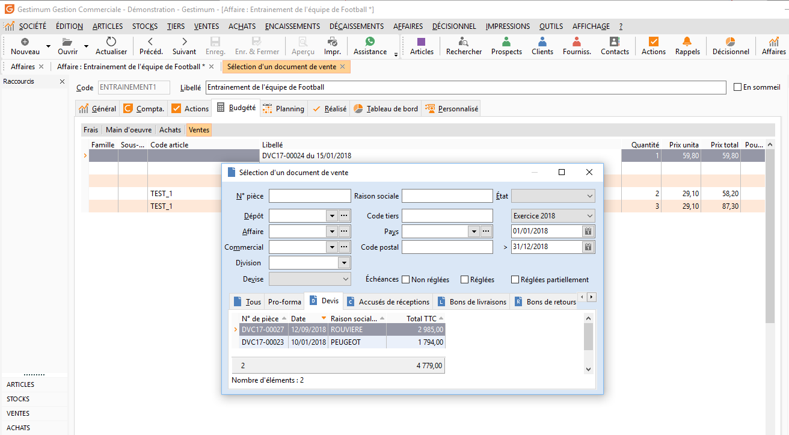

# Ventes budgétées

Plusieurs choix (cumulatifs) s’offre pour l’alimentation du budget de 
 ventes. Vous pouvez saisir les lignes une à une en alimentant ou pas les 
 différentes colonnes comme pour les achats mais sans possibilité de saisie 
 d’un code tiers. Ou vous pouvez aussi choisir d’intégrer le pied (total 
 hors taxes) ou les lignes détaillées d’un document.

 

 

Ou vous pouvez aussi choisir d’intégrer le pied (total hors taxes) ou 
 les lignes détaillées d’un document.

 

 

Sélectionner alors le document servant à alimenter le budget. Si un 
 client a été affecté à l’affaire, la liste des documents de vente apparaît 
 avec les valeurs du code affaire et du client affecté à l’affaire. Vous 
 pouvez modifier ces valeurs pour rechercher un document d’une autre affaire 
 ou d’un autre client.

 

 

Double cliquez sur le document choisi, il sera alors automatiquement 
 alimenté dans le budget des ventes.

