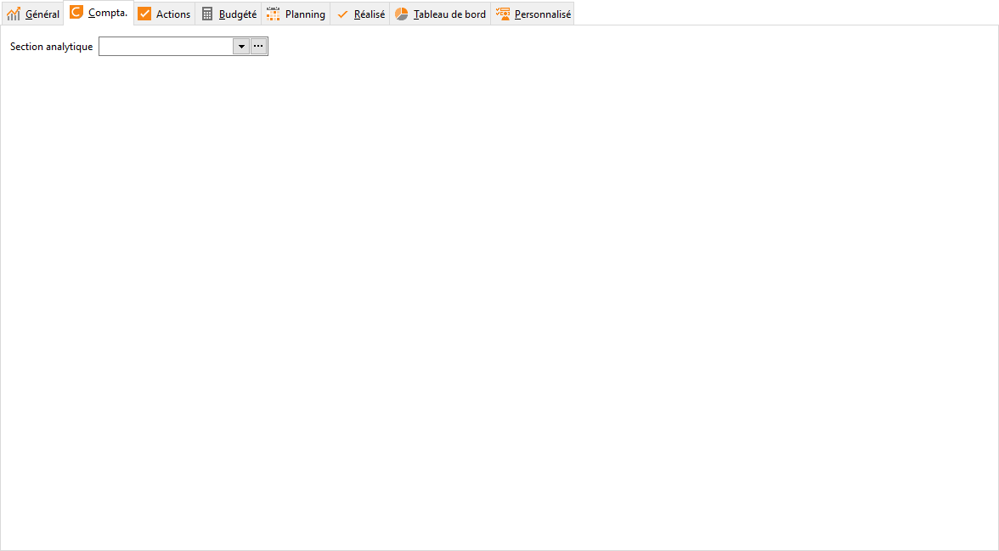

# Compta

L'onglet Compta permet d'affecter une section analytique à l'affaire.

 

En fonction du paramétrage dans les préférences de gestion (onglet Ventes 
 ou Achats), le transfert comptable se servira la section analytique de 
 l'affaire lors de la création des écritures.

 

