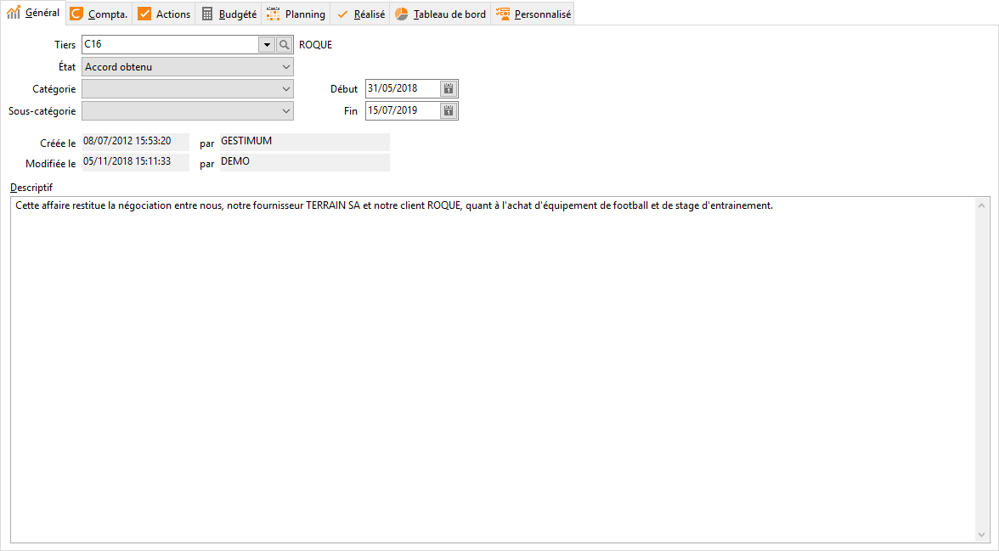

# Général

Cet onglet permet de paramétrer les renseignements généraux sur l’affaire 
 :

 

- affectation d’un tiers

- sélection de l’état, 
 de la catégorie, de la sous-catégorie 
 de l’affaire à créer dans les tables

- saisie de la période 
 de prise en compte pour l'affaire

- saisie d’un descriptif 
 détaillant l'affaire

 

